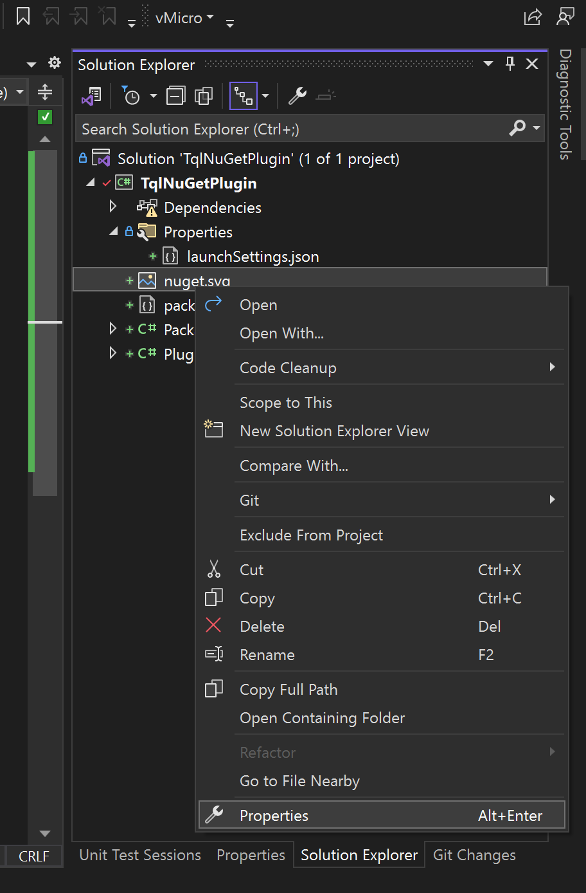
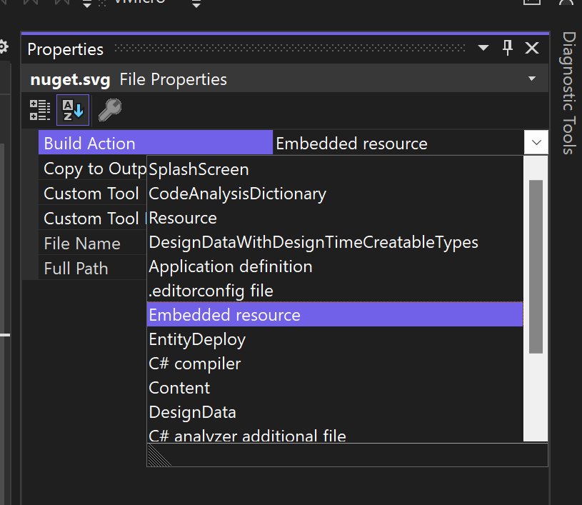
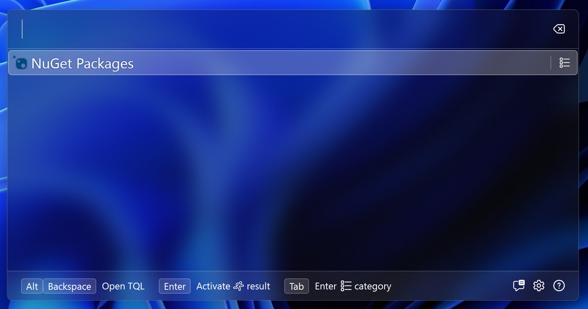

# Adding an icon

Every match has an icon associated with it. The simplest way to add them is to add icons as an embedded resource to your plugin and load them in a static class. We'll do this in this guide.

TQL supports both bitmap images (like PNGs and JPEGs), and SVG images. If you can find an SVG image, that's the preferred image type to use.

Complete the following steps to add the NuGet logo to your project:

- Download the logo from here: https://github.com/NuGet/Media/blob/main/Images/MainLogo/Vector/nuget.svg.

- Copy the logo into your project.

- Right click on the logo in the solution explorer and click **Properties**:
  
  

- Changed the **Build Action** to **Embedded Resource**:
  
  

This adds the icon to our class library. Next we'll create a class to load these resources. To do this, create a new class called **Images** and paste in the following code:

```cs
using System.Windows.Media;
using Tql.Utilities;

namespace TqlNuGetPlugin;

internal static class Images
{
    public static readonly ImageSource NuGetLogo = ImageFactory.FromEmbeddedResource(
        typeof(Images),
        "nuget.svg"
    );
}
```

This uses a method from the utilities NuGet package to load the embedded resource and turn it into an `ImageSource`. You can now update the `Icon` property on our match implementation to use this. Change this property to the following:

```cs
public ImageSource Icon => Images.NuGetLogo;
```

If you now start the app again and type in a single space again, the logo should appear:



Next will add the type ID.