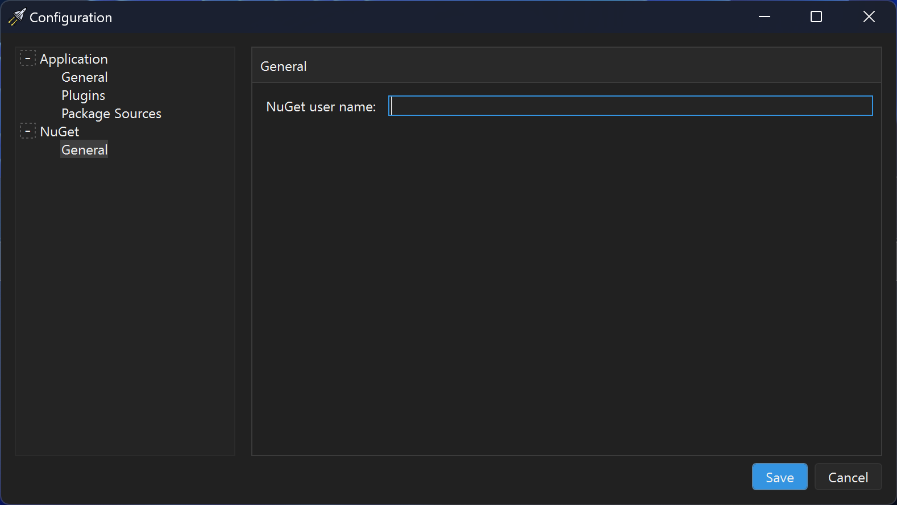
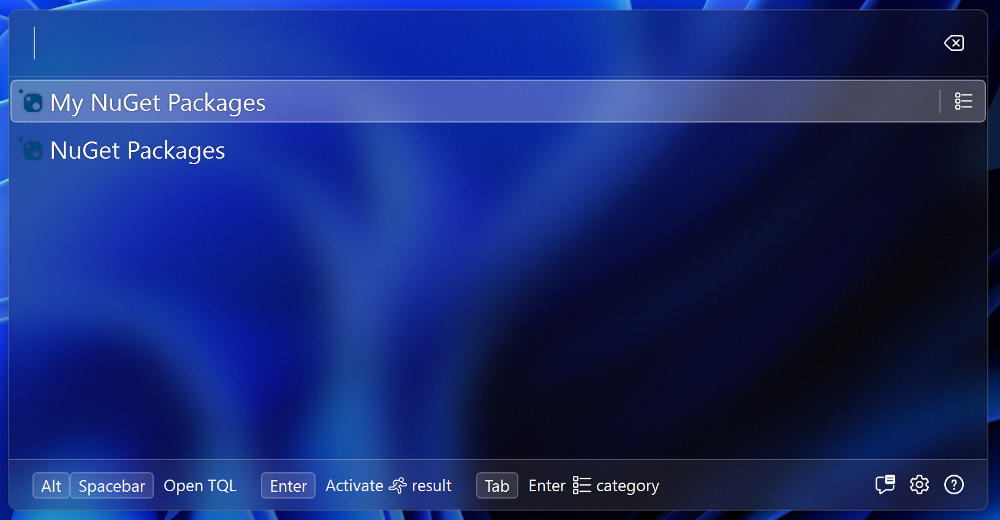
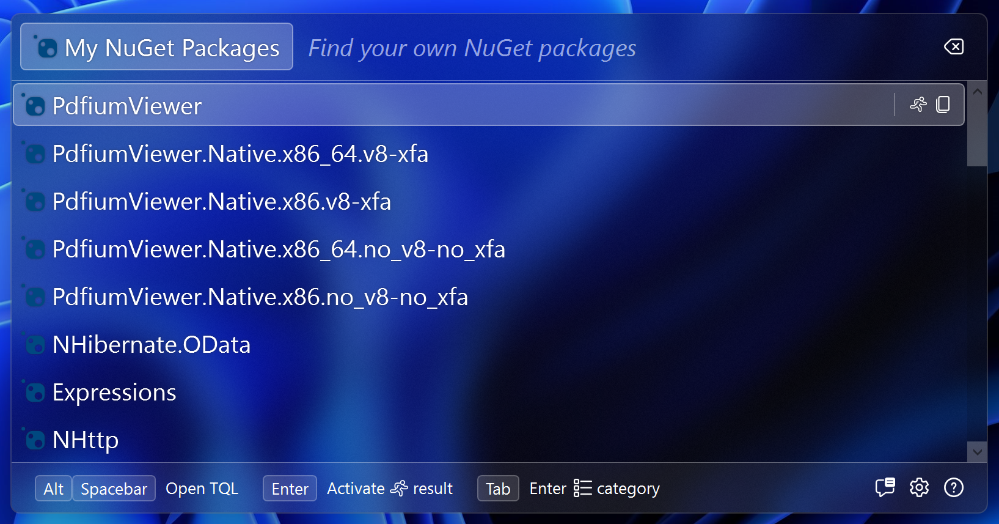

# Configuration UI

TQL allows plugins to add their own configuration pages to the configuration
window. In this guide we'll add a configuration page. We'll allow the user to
set their NuGet user name and use this to add a new category that returns only
packages of which the user is the owner.

## Create the configuration manager and UI

1. Add a new WPF user control named **ConfigurationControl**. Paste in the
   following XAML:

   ```xml
   <UserControl
     x:Class="TqlNuGetPlugin.ConfigurationControl"
     x:ClassModifier="internal"
     xmlns="http://schemas.microsoft.com/winfx/2006/xaml/presentation"
     xmlns:x="http://schemas.microsoft.com/winfx/2006/xaml"
     xmlns:mc="http://schemas.openxmlformats.org/markup-compatibility/2006"
     xmlns:d="http://schemas.microsoft.com/expression/blend/2008"
     xmlns:local="clr-namespace:TqlNuGetPlugin"
     mc:Ignorable="d"
     d:DesignHeight="450"
     d:DesignWidth="800">
     <GroupBox
       Header="General"
       Padding="4">
       <Grid>
         <Grid.RowDefinitions>
           <RowDefinition Height="Auto" />
         </Grid.RowDefinitions>
         <Grid.ColumnDefinitions>
           <ColumnDefinition Width="Auto" />
           <ColumnDefinition Width="*" />
         </Grid.ColumnDefinitions>

         <Label
           Content="NuGet user name:"
           Margin="3" />
         <TextBox
           x:Name="_userName"
           Margin="3"
           VerticalAlignment="Center"
           Grid.Column="1" />
       </Grid>
     </GroupBox>
   </UserControl>
   ```

   Paste in the following code:

   ```cs
   using Tql.Abstractions;
   using UserControl = System.Windows.Controls.UserControl;

   namespace TqlNuGetPlugin;

   internal partial class ConfigurationControl : UserControl, IConfigurationPage
   {
       private readonly ConfigurationManager _configurationManager;
       public Guid PageId => Guid.Parse("1921b828-d926-4923-84d4-4c4338352640");
       public string Title => "General";
       public ConfigurationPageMode PageMode => ConfigurationPageMode.Scroll;

       public ConfigurationControl(ConfigurationManager configurationManager)
       {
           _configurationManager = configurationManager;

           InitializeComponent();

           _userName.Text = _configurationManager.Configuration.UserName;
       }

       public void Initialize(IConfigurationPageContext context) { }

       public Task<SaveStatus> Save()
       {
           var userName = _userName.Text;
           if (string.IsNullOrEmpty(userName))
               userName = null;

           _configurationManager.SetConfiguration(new Configuration(userName));

           return Task.FromResult(SaveStatus.Success);
       }
   }
   ```

2. Add a **ConfigurationManager**:

   ```cs
   using System.Text.Json;
   using Tql.Abstractions;

   namespace TqlNuGetPlugin;

   internal class ConfigurationManager
   {
       private readonly IConfigurationManager _configurationManager;
       private volatile Configuration _configuration;

       public Configuration Configuration => _configuration;

       public ConfigurationManager(IConfigurationManager configurationManager)
       {
           _configurationManager = configurationManager;

           configurationManager.ConfigurationChanged += (_, e) =>
           {
               if (e.PluginId == Plugin.PluginId)
                   _configuration = ParseConfiguration(e.Configuration);
           };

           _configuration = ParseConfiguration(configurationManager.GetConfiguration(Plugin.PluginId));
       }

       private Configuration ParseConfiguration(string? json)
       {
           if (json == null)
               return new Configuration(null);

           return JsonSerializer.Deserialize<Configuration>(json)!;
       }

       public void SetConfiguration(Configuration configuration)
       {
           _configurationManager.SetConfiguration(
               Plugin.PluginId,
               JsonSerializer.Serialize(configuration)
           );
       }
   }

   internal record Configuration(string? UserName);
   ```

3. Update **ConfigurationService** method in the **Plugin** to register the
   configuration manager and control:
   ```cs
   public void ConfigureServices(IServiceCollection services)
   {
       services.AddSingleton<ConfigurationManager>();
       services.AddTransient<ConfigurationControl>();

       ...
   ```
4. Replace the **GetConfigurationPages** method class in the **Plugin** class to
   return the new configuration page:

   ```cs
   public IEnumerable<IConfigurationPage> GetConfigurationPages()
   {
       yield return _serviceProvider!.GetRequiredService<ConfigurationControl>();
   }
   ```

If you now start the app and open the configuration page, the configuration page
will show:



Enter your user name and verify that's it's being saved.

> [!IMPORTANT] The **IConfigurationManager** service should be used for managing
> all user settings. There's an outstanding feature request to
> [implement cross device sync](https://github.com/TQLApp/TQL/issues/15) for
> TQL. Settings managed using the **IConfigurationManager** service will be
> synced automatically.
>
> If you need to store user credentials, you should use the **IEncryption**
> service. This service encrypts and decrypts data in a secure manner. This
> service also ensures that data encrypted on one device can be decrypted on
> other devices.

## Package search

We'll now add a new category that allows users to search their own packages.

1. Add a new **MyPackagesMatch** class and paste in the following code:

   ```cs
   using System.Text.Json;
   using System.Windows.Media;
   using Tql.Abstractions;

   namespace TqlNuGetPlugin;

   internal class MyPackagesMatch(
       NuGetClient client,
       IMatchFactory<PackageMatch, PackageDto> factory,
       ConfigurationManager configurationManager
   ) : ISearchableMatch, ISerializableMatch
   {
       public string Text => "My NuGet Packages";
       public ImageSource Icon => Images.NuGetLogo;
       public MatchTypeId TypeId => TypeIds.MyPackages;
       public string SearchHint => "Find your own NuGet packages";

       public async Task<IEnumerable<IMatch>> Search(
           ISearchContext context,
           string text,
           CancellationToken cancellationToken
       )
       {
           await context.DebounceDelay(cancellationToken);

           var userName = configurationManager.Configuration.UserName;

           return from package in await client.Search($"owner:{userName} {text}", cancellationToken)
               select factory.Create(new PackageDto(package.Identity.Id, package.IconUrl?.ToString()));
       }

       public string Serialize()
       {
           return JsonSerializer.Serialize(new PackagesDto());
       }
   }
   ```

   This class is based off of the **PackagesMatch** class with the following
   modifications:

   - The text and search hint have been updated.
   - **TypeId** points to a new **MatchTypeId**.
   - The **Search** method includes the owner user name in its search.
   - The **Search** method returns results even if the search query is empty.
     This will show all users packages when the user enters the category.

2. Add a new **MyPackagesType** class and paste in the following code:

   ```cs
   using Tql.Abstractions;
   using Tql.Utilities;

   namespace TqlNuGetPlugin;

   internal class MyPackagesType(
       IMatchFactory<PackagesMatch, PackagesDto> factory,
       ConfigurationManager configurationManager
   ) : MatchType<PackagesMatch, PackagesDto>(factory)
   {
       public override Guid Id => TypeIds.MyPackages.Id;

       protected override bool IsValid(PackagesDto dto) =>
           configurationManager.Configuration.UserName != null;
   }
   ```

   This is a copy of the **PackagesType** class with the new **MatchTypeId** and
   an implementation of the **IsValid** method. This implementation ensures that
   TQL won't show the new category in the history if the user removes their user
   name from the configuration.

3. Add the new **MatchTypeId** to the **TypeIds** class:

   ```cs
   public static readonly MatchTypeId MyPackages = new MatchTypeId(
       Guid.Parse("b7f0792c-5b5e-454b-a5c6-becb984ccd8f"),
       Plugin.PluginId
   );
   ```

4. Register the **MyPackagesMatch** class as a transient service in the
   **ConfigureServices** method of the **Plugin** class:

   ```cs
   services.AddTransient<MyPackagesMatch>();
   ```

5. Update the **Initialize** method in the **Plugin** class to get a reference
   to the **ConfigurationManager** service:

   ```cs
   private ConfigurationManager? _configurationManager;

   public void Initialize(IServiceProvider serviceProvider)
   {
       _serviceProvider = serviceProvider;
       _configurationManager = serviceProvider.GetRequiredService<ConfigurationManager>();

       ...
   ```

6. Update the **GetMatches** method in the **Plugin** class to only return the
   new category if the user has set their user name:

   ```cs
   public IEnumerable<IMatch> GetMatches()
   {
       yield return _serviceProvider!.GetRequiredService<PackagesMatch>();
       if (_configurationManager!.Configuration.UserName != null)
           yield return _serviceProvider!.GetRequiredService<MyPackagesMatch>();
   }
   ```

If you now start the app, the new category will show:



If you enter the category, your NuGet packages will show:


