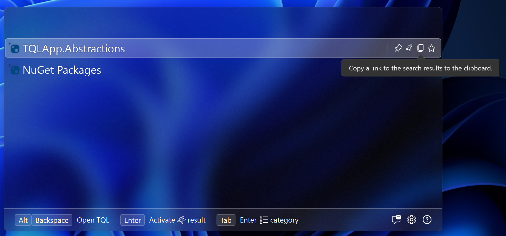
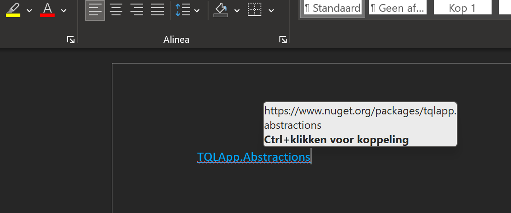

# Copying matches

The `ICoppyableMatch` interface gives TQL a way to copy matches. If you
implement this interface, a copy icon will be added next to your match. If the
user clicks it, TQL calls into the `Copy` method on the interface to allow you
to copy something to the clipboard.

We'll implement this interface on the `PackageMatch` class. Add the
`ICopyableMatch` interface to it and then paste the following code into the
class:

```cs
public Task Copy(IServiceProvider serviceProvider)
{
    var url = $"https://www.nuget.org/packages/{Uri.EscapeUriString(_dto.PackageId)}";

    serviceProvider.GetRequiredService<IClipboard>().CopyUri(Text, url);

    return Task.CompletedTask;
}
```

This is the standard pattern you'll use for copyable matches. The URL is the
same as the one in the `Run` method. The `IClipboard` service has helper methods
for working with the clipboard. The `CopyUri` method copies a nicely formatted
link to the clipboard, using the `Text` of the match as a label.

If you now run the project again, the copy item should appear next to any
package match:



If you click this and e.g. paste this into Word, you'll get the following:



The `IClipboard` service also has a `CopyMarkdown` method that allows you to do
more advanced formatting.
