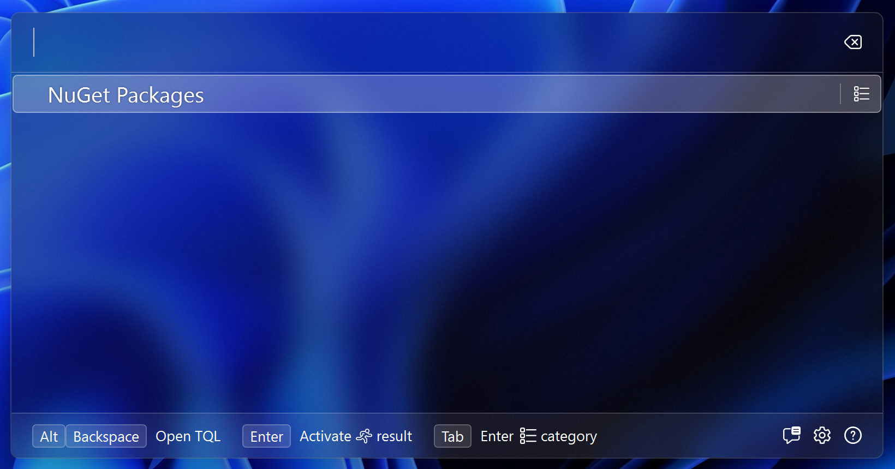
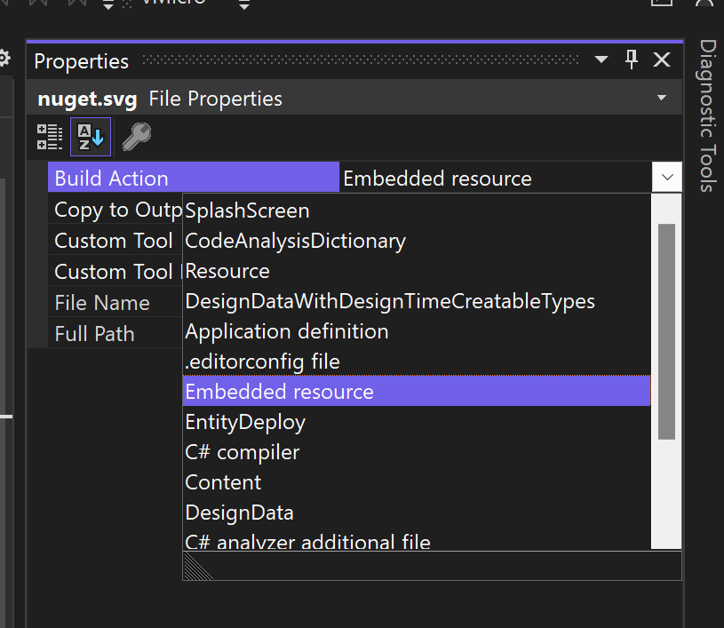

# Create a plugin

This guide shows how to create a plugin for Techie's Quick Launcher. TQL plugins
are C# class libraries. You need Visual Studio to build one. Have a look at the
[Development environment](Development-environment.md) page for how to setup your
computer.

## Create a new project

1. Open Visual Studio:

   

2. Click **Create a new project**, search for "class library" and pick the C#
   version of the **Class Library** template:

   

3. Give your plugin a name, e.g. "TqlNuGetPlugin":

   

4. In **Framework**, pick the latest framework. TQL plugins must be .NET
   Framework 4.8. We'll change to that in a bit:

   

   Visual Studio now opens the newly created project. We still need to make a
   few changes to the project file to make sure the plugin is going to work
   properly with TQL.

5. Right click on the project and click **Edit Project File**.

6. Change the project file to the following:

   ```xml
   <Project Sdk="Microsoft.NET.Sdk">
     <PropertyGroup>
       <TargetFramework>net48</TargetFramework>
       <ImplicitUsings>enable</ImplicitUsings>
       <Nullable>enable</Nullable>
       <LangVersion>latest</LangVersion>
       <UseWPF>true</UseWPF>
       <UseWindowsForms>true</UseWindowsForms>
       <RestorePackagesWithLockFile>true</RestorePackagesWithLockFile>
     </PropertyGroup>
   </Project>
   ```

   - This makes the following changes to the project:
     - The target framework is .NET 4.8.
     - We use the latest C# language version.
     - WPF and Windows Forms is enabled.
     - NuGet lock files are enabled.

## Add NuGet dependencies

The entry point for TQL into your plugin is the plugin class. This class needs
to implement the `ITqlPlugin` interface from the
[TQLApp.Abstractions](https://www.nuget.org/packages/TQLApp.Abstractions) NuGet
package. TQL publishes two NuGet packages to help you create TQL plugins. The
second is a NuGet package with utility classes. Instead of adding the
abstractions NuGet package directly, you should add the
[TQLApp.Utilities](https://www.nuget.org/packages/TQLApp.Utilities) NuGet
package instead:

1. Right click on the project file and click **Manage NuGet Packages...**.

2. Search for "tqlapp.utilities" and click **Install**:

   

## Create the plugin class

TQL plugins must implement the `ITqlPlugin` interface and must specify the
`TqlPluginAttribute` attribute for TQL to pick them up.

> [!IMPORTANT] This code snippet contains a GUID. More code snippets in this
> guide will have one. You need to replace these with a newly generated one when
> using these code snippets. The
> [Insert Guid](https://marketplace.visualstudio.com/items?itemName=MadsKristensen.insertguid)
> Visual Studio extension is a useful extension to do this from inside the IDE.

1. Replace the automatically generated **Class1.cs** file with a new file called
   **Plugin.cs** and paste in the following content:

   ```cs
   using Microsoft.Extensions.DependencyInjection;
   using Tql.Abstractions;

   namespace TqlNuGetPlugin;

   [TqlPlugin]
   public class Plugin : ITqlPlugin
   {
       public static readonly Guid PluginId = Guid.Parse("74bc3db4-c951-442b-921c-887921772d64");

       public Guid Id => PluginId;
       public string Title => "NuGet";

       public void ConfigureServices(IServiceCollection services) { }

       public void Initialize(IServiceProvider serviceProvider) { }

       public IMatch? DeserializeMatch(Guid typeId, string value)
       {
           return null;
       }

       public IEnumerable<IMatch> GetMatches()
       {
           yield break;
       }

       public IEnumerable<IConfigurationPage> GetConfigurationPages()
       {
           yield break;
       }
   }
   ```

## Setup debugging

To test the plugin, you need to run it using TQL. This guide assumes you have
the latest version of TQL installed locally. You need to change your launch
profile to use this version of TQL:

1. Open the **Debug | TqlNuGetPlugin Debug Properties** menu item:

   

2. Remove the automatically generated launch profile and replace it with a new
   one of type **Executable**.

3. Configure the launch profile as follows:

   

   1. Set the path to the executable to this:
      "%LOCALAPPDATA%\\Programs\\TQL\\Tql.App.exe". This configures the launch
      profile to use the locally installed TQL version.

   2. Set the command line arguments to this: "--env NuGetPlugin --sideload .".
      This creates an isolated environment for your plugin and side loads it
      from the current working directory. This will be the build folder of your
      class library.

   3. Rename the launch profile to e.g. **Run**.

   4. Start your project.

TQL now starts with a clean environment with your plugin installed. If you want to verify that your plugin is picked up, you
can set a break point in the `ConfigureServices` method.

## Create a category match

TQL distinguishes roughly two types of matches: categories (or searchable) and
runnable matches. Categories are what you search, and runnable matches is what
the search returns. We start with adding a category match.

1. Add a new class called **PackagesMatch** and paste in the following contents:

   ```cs
   using System.Windows.Media;
   using Tql.Abstractions;

   namespace TqlNuGetPlugin;

   internal class PackagesMatch : ISearchableMatch
   {
       public string Text => "NuGet Packages";
       public ImageSource Icon { get; }
       public MatchTypeId TypeId { get; }
       public string SearchHint => "Find NuGet packages";

       public Task<IEnumerable<IMatch>> Search(
           ISearchContext context,
           string text,
           CancellationToken cancellationToken
       )
       {
           throw new NotImplementedException();
       }
   }
   ```

2. This is a base implementation for a searchable match. To let TQL know of the
   match, we need to return an instance of it form the `GetMatches()` method in the
   plugin. Update that method the following:
   
   ```cs
   public IEnumerable<IMatch> GetMatches()
   {
       yield return new PackagesMatch();
   }
   ```

3. Start your project.

4. Type a single space into the search box. This will show your match:

 

## Add an icon

Every match has an icon associated with it. The simplest way to add them is to
add icons as an embedded resource to your plugin and load them in a static
class.

> [!TIP]
> TQL supports both bitmap images (like PNGs and JPEGs), and SVG images. If you
> can find an SVG image, that's the preferred image type to use.

1. Download the logo from here: https://github.com/NuGet/Media/blob/main/Images/MainLogo/Vector/nuget.svg.

2. Copy the logo into your project.

3. Right click on the logo in the solution explorer and click **Properties**:

   

4. Changed the **Build Action** to **Embedded Resource**:

   

   This adds the icon to our class library.
   
Next we'll create a class to load these resources.

5. Create a new class called **Images** and paste in the following code:
   
   ```cs
   using System.Windows.Media;
   using Tql.Utilities;
   
   namespace TqlNuGetPlugin;
   
   internal static class Images
   {
       public static readonly ImageSource NuGetLogo = ImageFactory.FromEmbeddedResource(
           typeof(Images),
           "nuget.svg"
       );
   }
   ```

   > [!NOTE]
   > This uses a method from the utilities NuGet package to load the embedded
   > resource and turn it into an `ImageSource`.
   
6. Update the `Icon` property on our match implementation to use this. Change this property to the following:
   
   ```cs
   public ImageSource Icon => Images.NuGetLogo;
   ```

7. Start your project.
   
8. Type a single space into the search box. This will show your match again, now with an icon 

   

## Add a type ID

Every match class in TQL is identified by a type ID. These are used e.g. as
stable names in the user's history.

> [!TIP]
> It's best practice to put  type IDs in a separate class.

1. Create a new class called **TypeIds** and paste in the following code:
   
   ```cs
   using Tql.Abstractions;
   
   namespace TqlNuGetPlugin;
   
   internal static class TypeIds
   {
       public static readonly MatchTypeId Packages = new MatchTypeId(
           Guid.Parse("b1c8f27b-8534-4ee7-bcc6-e45fef01e5bc"),
           Plugin.PluginId
       );
   }
   ```

   Type IDs are a combination of the ID of the match and the ID of the plugin.

2. Update the `TypeId` property of the match implementation to use the new class:
   
   ```cs
   public MatchTypeId TypeId => TypeIds.Packages;
   ```

## Create a runnable match

We now have everything we need to start implementing our search functionality,
but we can't yet return anything. We need to implement a runnable match for this.

> [!IMPORTANT]
> It's best practice to define DTO objects for all matches. DTO object should be immutable, so the C# `record` type is a good fit. If you need to store collections, you should do this using classes from the [System.Collections.Immutable](https://www.nuget.org/packages/System.Collections.Immutable/) NuGet package.

1. Add a new class called **PackageMatch** and paste in the following code:
   
   ```cs
   using System.Windows.Media;
   using Tql.Abstractions;
   
   namespace TqlNuGetPlugin;
   
   internal class PackageMatch : IRunnableMatch
   {
       private readonly PackageDto _dto;
   
       public string Text => _dto.PackageId;
       public ImageSource Icon => Images.NuGetLogo;
       public MatchTypeId TypeId => TypeIds.Package;
   
       public PackageMatch(PackageDto dto)
       {
           _dto = dto;
       }
   
       public Task Run(IServiceProvider serviceProvider, IWin32Window owner)
       {
           throw new NotImplementedException();
       }
   }
   
   internal record PackageDto(string PackageId);
   ```

2. Because our project is a .NET Framework project, we need to add a missing attribute to our class project for us to be able to use `record` types. Add a new file called **CompilerServices** and paste in the following content:
   
   ```cs
   namespace System.Runtime.CompilerServices
   {
       internal static class IsExternalInit { }
   }
   ```

3. Add the following code to the `TypeIds` class:
   
   ```cs
   public static readonly MatchTypeId Package = new MatchTypeId(
       Guid.Parse("188fcd76-a9b9-485e-a0ae-bd5da448a668"),
       Plugin.PluginId
   );
   ```
