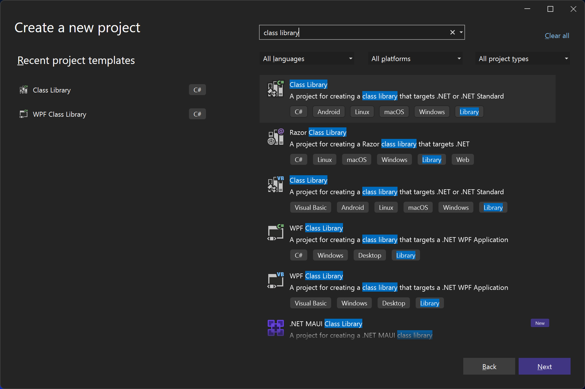
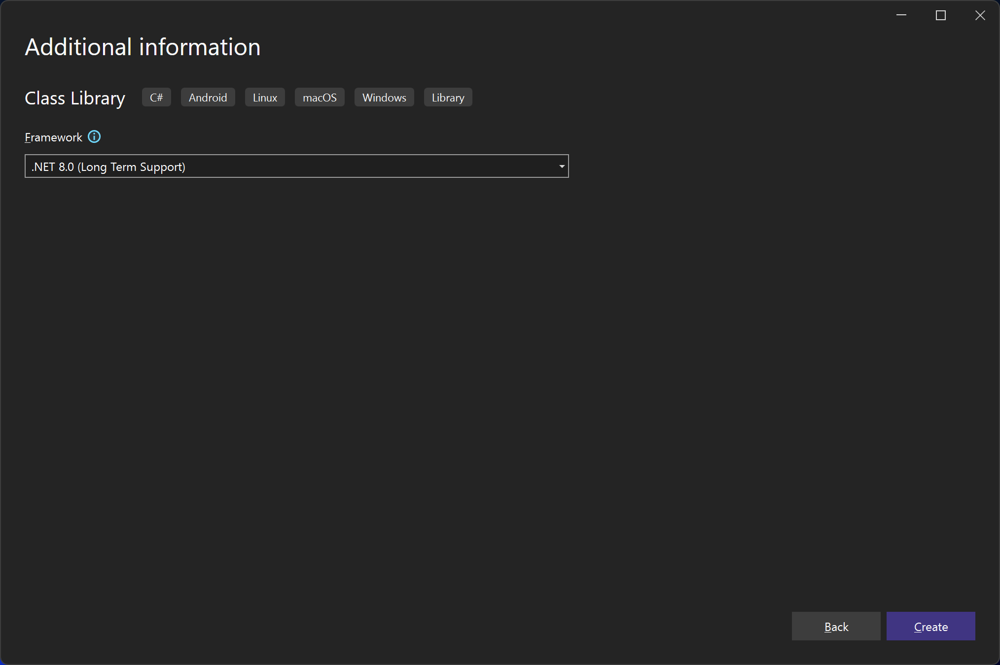

# Create a plugin

This guide shows how to create a plugin for Techie's Quick Launcher. TQL plugins are C# class libraries. You need Visual Studio to build one. Have a look at the [Development environment](Development-environment.md) page for how to setup your computer.

## Create a new project

1. Open Visual Studio:

   

2. Click **Create a new project**, search for "class library" and pick the C#
  version of the **Class Library** template:

   

3. Give your plugin a name, e.g. "TqlNuGetPlugin":

   

4. In **Framework**, pick the latest framework. TQL plugins must be .NET
  Framework 4.8. We'll change to that in a bit:

   

   Visual Studio now opens the newly created project. We still need to make a few changes to the project file to make sure the plugin is going to work properly with TQL.

5. Right click on the project and click **Edit Project File**.

6. Change the project file to the following:

   ```xml
   <Project Sdk="Microsoft.NET.Sdk">
     <PropertyGroup>
       <TargetFramework>net48</TargetFramework>
       <ImplicitUsings>enable</ImplicitUsings>
       <Nullable>enable</Nullable>
       <LangVersion>latest</LangVersion>
       <UseWPF>true</UseWPF>
       <UseWindowsForms>true</UseWindowsForms>
       <RestorePackagesWithLockFile>true</RestorePackagesWithLockFile>
     </PropertyGroup>
   </Project>
   ```

   - This makes the following changes to the project:
     - The target framework is .NET 4.8.
     - We use the latest C# language version.
     - WPF and Windows Forms is enabled.
     - NuGet lock files are enabled.

## Add NuGet dependencies

The entry point for TQL into your plugin is the plugin class. This class needs
to implement the `ITqlPlugin` interface from the
[TQLApp.Abstractions](https://www.nuget.org/packages/TQLApp.Abstractions) NuGet
package. TQL publishes two NuGet packages to help you create TQL plugins. The
second is a NuGet package with utility classes. Instead of adding the
abstractions NuGet package directly, you should add the
[TQLApp.Utilities](https://www.nuget.org/packages/TQLApp.Utilities) NuGet
package instead:

1. Right click on the project file and click **Manage NuGet Packages...**.

2. Search for "tqlapp.utilities" and click **Install**:

   

## Create the plugin class

TQL plugins must implement the `ITqlPlugin` interface and must specify the
`TqlPluginAttribute` attribute for TQL to pick them up.

> [!IMPORTANT]
> This code snippet contains a GUID. More code snippets in this guide will have one.
> You need to replace these with a newly generated one when using these code snippets. The
> [Insert Guid](https://marketplace.visualstudio.com/items?itemName=MadsKristensen.insertguid) Visual Studio extension is a useful extension to do this from inside the IDE.

1. Replace the automatically generated **Class1.cs** file with a new file called **Plugin.cs** and paste in the following content:

   ```cs
   using Microsoft.Extensions.DependencyInjection;
   using Tql.Abstractions;
   
   namespace TqlNuGetPlugin;
   
   [TqlPlugin]
   public class Plugin : ITqlPlugin
   {
       public static readonly Guid PluginId = Guid.Parse("74bc3db4-c951-442b-921c-887921772d64");
   
       public Guid Id => PluginId;
       public string Title => "NuGet";
   
       public void ConfigureServices(IServiceCollection services) { }
   
       public void Initialize(IServiceProvider serviceProvider) { }
   
       public IMatch? DeserializeMatch(Guid typeId, string value)
       {
           return null;
       }
   
       public IEnumerable<IMatch> GetMatches()
       {
           yield break;
       }
   
       public IEnumerable<IConfigurationPage> GetConfigurationPages()
       {
           yield break;
       }
   }
   ```

## Setup debugging

To test the plugin, you need to run it using TQL. This guide assumes you have
the latest version of TQL installed locally. You need to change your launch
profile to use this version of TQL:

1. Open the **Debug | TqlNuGetPlugin Debug Properties** menu item:

   

2. Remove the automatically generated launch profile and replace it with a new
  one of type **Executable**.

3. Configure the launch profile as follows:

   

   1. Set the path to the executable to this:
    "%LOCALAPPDATA%\\Programs\\TQL\\Tql.App.exe". This configures the launch
    profile to use the locally installed TQL version.

   2. Set the command line arguments to this: "--env NuGetPlugin --sideload .".
    This creates an isolated environment for your plugin and side loads it from
    the current working directory. This will be the build folder of your class
    library.

   3. Rename the launch profile to e.g. **Run**.

   4. If you now start the new launch profile, TQL should start with a clean configuration. If you want to verify that your plugin is picked up, you can set a break point in the `ConfigureServices` method.

## Creating the category match

TQL distinguishes roughly two types of matches: categories (or searchable) and runnable matches.
Categories are what you search, and runnable matches is what the search returns. We start with adding a category match.

1. Add a new class called **PackagesMatch** and paste in the following contents:

   ```cs
   using System.Windows.Media;
   using Tql.Abstractions;
   
   namespace TqlNuGetPlugin;
   
   internal class PackagesMatch : ISearchableMatch
   {
       public string Text => "NuGet Packages";
       public ImageSource Icon { get; }
       public MatchTypeId TypeId { get; }
       public string SearchHint => "Find NuGet packages";
   
       public Task<IEnumerable<IMatch>> Search(
           ISearchContext context,
           string text,
           CancellationToken cancellationToken
       )
       {
           throw new NotImplementedException();
       }
   }
   ```

This is a base implementation for a searchable match. To let TQL know of the
match, we need to return an instance of it form the `GetMatches()` method in the
plugin. Update that method the following:

   ```cs
   public IEnumerable<IMatch> GetMatches()
   {
       yield return new PackagesMatch();
   }
   ```

If you now start the app again and type a single space into the search box, your
match will show:


That's great progress already!

Next we'll add some supporting code to improve on this simple implementation.
