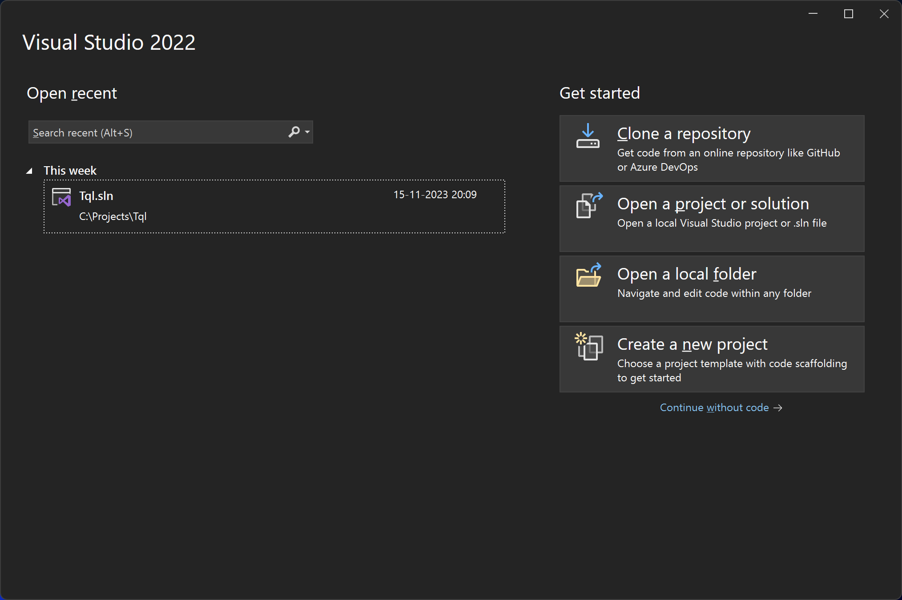
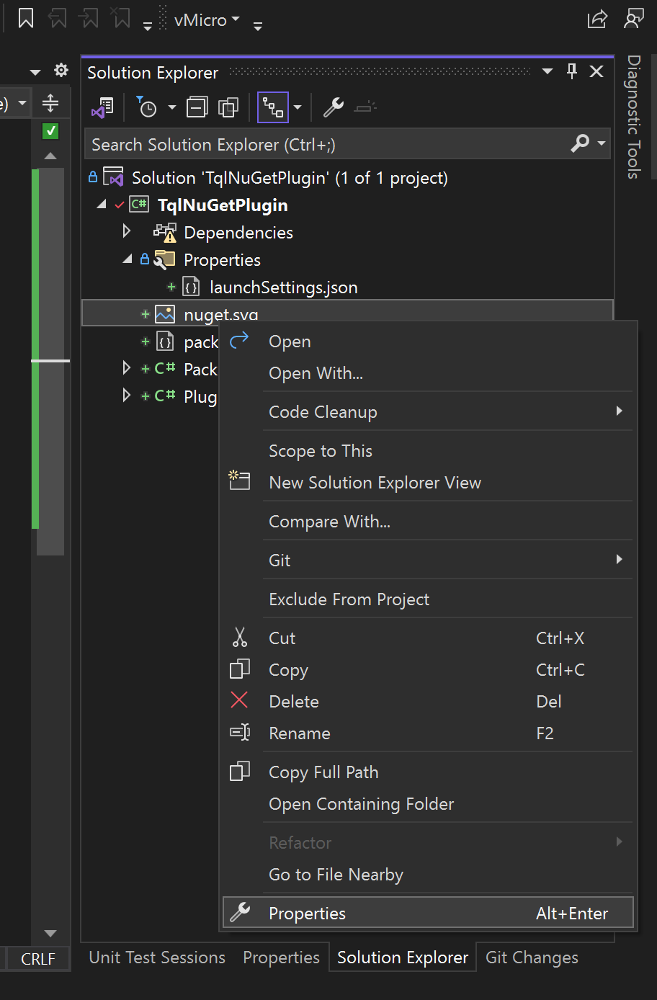

# Create a plugin

This guide shows how to create a plugin for Techie's Quick Launcher. TQL plugins
are C# class libraries. You need Visual Studio to build one. Have a look at the
[Development environment](Development-environment.md) page for how to setup your
computer.

## Create a new project

1. Open Visual Studio:

   

2. Click **Create a new project**, search for "class library" and pick the C#
   version of the **Class Library** template:

   

3. Give your plugin a name, e.g. "TqlNuGetPlugin":

   

4. Use .NET 8 as the framework:

   

   Visual Studio now opens the newly created project. We still need to make a
   few changes to the project file to make sure the plugin is going to work
   properly with TQL.

5. Right click on the project and click **Edit Project File**.

6. Change the project file to the following:

   ```xml
   <Project Sdk="Microsoft.NET.Sdk">
     <PropertyGroup>
       <TargetFramework>net8.0-windows</TargetFramework>
       <ImplicitUsings>enable</ImplicitUsings>
       <Nullable>enable</Nullable>
       <LangVersion>12.0</LangVersion>
       <UseWPF>true</UseWPF>
       <UseWindowsForms>true</UseWindowsForms>
       <RestorePackagesWithLockFile>true</RestorePackagesWithLockFile>
     </PropertyGroup>
   </Project>
   ```

   - This makes the following changes to the project:
     - The target framework is .NET 8, Windows specific.
     - Use C# 12.
     - WPF and Windows Forms is enabled.
     - NuGet lock files are enabled.

## Add NuGet dependencies

The entry point for TQL into your plugin is the plugin class. This class needs
to implement the `ITqlPlugin` interface from the
[TQLApp.Abstractions](https://www.nuget.org/packages/TQLApp.Abstractions) NuGet
package. TQL publishes two NuGet packages to help you create TQL plugins. The
second is a NuGet package with utility classes. Instead of adding the
abstractions NuGet package directly, you should add the
[TQLApp.Utilities](https://www.nuget.org/packages/TQLApp.Utilities) NuGet
package instead:

1. Right click on the project file and click **Manage NuGet Packages...**.

2. Search for "tqlapp.utilities" and click **Install**:

   

## Create the plugin class

TQL plugins must implement the `ITqlPlugin` interface and must specify the
`TqlPluginAttribute` attribute for TQL to pick them up.

> [!IMPORTANT] This code snippet contains a GUID. More code snippets in this
> guide will have one. You need to replace these with a newly generated one when
> using these code snippets. The
> [Insert Guid](https://marketplace.visualstudio.com/items?itemName=MadsKristensen.insertguid)
> Visual Studio extension is a useful extension to do this from inside the IDE.

1. Replace the automatically generated **Class1.cs** file with a new file called
   **Plugin.cs** and paste in the following content:

   ```cs
   using Microsoft.Extensions.DependencyInjection;
   using Tql.Abstractions;

   namespace TqlNuGetPlugin;

   [TqlPlugin]
   public class Plugin : ITqlPlugin
   {
       public static readonly Guid PluginId = Guid.Parse("74bc3db4-c951-442b-921c-887921772d64");

       public Guid Id => PluginId;
       public string Title => "NuGet";

       public void ConfigureServices(IServiceCollection services) { }

       public void Initialize(IServiceProvider serviceProvider) { }

       public IMatch? DeserializeMatch(Guid typeId, string value)
       {
           return null;
       }

       public IEnumerable<IMatch> GetMatches()
       {
           yield break;
       }

       public IEnumerable<IConfigurationPage> GetConfigurationPages()
       {
           yield break;
       }
   }
   ```

## Setup debugging

To test the plugin, you need to run it using TQL. This guide assumes you have
the latest version of TQL installed locally. You need to change your launch
profile to use this version of TQL:

1. Open the **Debug | TqlNuGetPlugin Debug Properties** menu item:

   

2. Remove the automatically generated launch profile and replace it with a new
   one of type **Executable**.

3. Configure the launch profile as follows:

   

   1. Set the path to the executable to this:
      "%LOCALAPPDATA%\\Programs\\TQL\\Tql.App.exe". This configures the launch
      profile to use the locally installed TQL version.

   2. Set the command line arguments to this: "--env NuGetPlugin --sideload .".
      This creates an isolated environment for your plugin and side loads it
      from the current working directory. This will be the build folder of your
      class library.

   3. Rename the launch profile to e.g. **Run**.

   4. Start your project.

TQL now starts with a clean environment with your plugin installed. If you want
to verify that your plugin is picked up, you can set a break point in the
`ConfigureServices` method.

## Create a category match

TQL distinguishes roughly two types of matches: categories (or searchable) and
runnable matches. Categories are what you search, and runnable matches is what
the search returns. We start with adding a category match.

1. Add a new class called **PackagesMatch** and paste in the following contents:

   ```cs
   using System.Windows.Media;
   using Tql.Abstractions;

   namespace TqlNuGetPlugin;

   internal class PackagesMatch : ISearchableMatch
   {
       public string Text => "NuGet Packages";
       public ImageSource Icon { get; }
       public MatchTypeId TypeId { get; }
       public string SearchHint => "Find NuGet packages";

       public Task<IEnumerable<IMatch>> Search(
           ISearchContext context,
           string text,
           CancellationToken cancellationToken
       )
       {
           throw new NotImplementedException();
       }
   }
   ```

2. This is a base implementation for a searchable match. To let TQL know of the
   match, we need to return an instance of it form the `GetMatches()` method in
   the plugin. Update that method the following:

   ```cs
   public IEnumerable<IMatch> GetMatches()
   {
       yield return new PackagesMatch();
   }
   ```

3. Start your project.

4. Type a single space into the search box. This will show your match:


## Add an icon

Every match has an icon associated with it. The simplest way to add them is to
add icons as an embedded resource to your plugin and load them in a static
class.

> [!TIP] TQL supports both bitmap images (like PNGs and JPEGs), and SVG images.
> If you can find an SVG image, that's the preferred image type to use.

1. Download the logo from here:
   https://github.com/NuGet/Media/blob/main/Images/MainLogo/Vector/nuget.svg.

2. Copy the logo into your project.

3. Right click on the logo in the solution explorer and click **Properties**:

   

4. Changed the **Build Action** to **Embedded Resource**:

   

   This adds the icon to our class library.

Next we'll create a class to load these resources.

5. Create a new class called **Images** and paste in the following code:

   ```cs
   using System.Windows.Media;
   using Tql.Utilities;

   namespace TqlNuGetPlugin;

   internal static class Images
   {
       public static readonly ImageSource NuGetLogo = ImageFactory.FromEmbeddedResource(
           typeof(Images),
           "nuget.svg"
       );
   }
   ```

   > [!NOTE] This uses a method from the utilities NuGet package to load the
   > embedded resource and turn it into an `ImageSource`.

6. Update the `Icon` property on our match implementation to use this. Change
   this property to the following:

   ```cs
   public ImageSource Icon => Images.NuGetLogo;
   ```

7. Start your project.
8. Type a single space into the search box. This will show your match again, now
   with an icon

   

## Add a type ID

Every match class in TQL is identified by a type ID. These are used e.g. as
stable names in the user's history.

> [!TIP] It's best practice to put type IDs in a separate class.

1. Create a new class called **TypeIds** and paste in the following code:

   ```cs
   using Tql.Abstractions;

   namespace TqlNuGetPlugin;

   internal static class TypeIds
   {
       public static readonly MatchTypeId Packages = new MatchTypeId(
           Guid.Parse("b1c8f27b-8534-4ee7-bcc6-e45fef01e5bc"),
           Plugin.PluginId
       );
   }
   ```

   Type IDs are a combination of the ID of the match and the ID of the plugin.

2. Update the `TypeId` property of the match implementation to use the new
   class:

   ```cs
   public MatchTypeId TypeId => TypeIds.Packages;
   ```

## Create a runnable match

We now have everything we need to start implementing our search functionality,
but we can't yet return anything. We need to implement a runnable match for
this.

> [!IMPORTANT] It's best practice to define DTO objects for all matches. DTO
> object should be immutable, so the C# `record` type is a good fit. If you need
> to store collections, you should do this using classes from the
> [System.Collections.Immutable](https://www.nuget.org/packages/System.Collections.Immutable/)
> NuGet package.

1. Add a new class called **PackageMatch** and paste in the following code:

   ```cs
   using System.Windows.Media;
   using Tql.Abstractions;

   namespace TqlNuGetPlugin;

   internal class PackageMatch(PackageDto dto) : IRunnableMatch
   {
       public string Text => dto.PackageId;
       public ImageSource Icon => Images.NuGetLogo;
       public MatchTypeId TypeId => TypeIds.Package;

       public Task Run(IServiceProvider serviceProvider, IWin32Window owner)
       {
           throw new NotImplementedException();
       }
   }

   internal record PackageDto(string PackageId);
   ```

2. Add the following code to the `TypeIds` class:

   ```cs
   public static readonly MatchTypeId Package = new MatchTypeId(
       Guid.Parse("188fcd76-a9b9-485e-a0ae-bd5da448a668"),
       Plugin.PluginId
   );
   ```

## Implement search

We'll implement search using the NuGet client NuGet packages.

> [!IMPORTANT] TQL uses Microsoft Depedency Injection. The `ConfigureServices`
> method in your plugin class allows you to setup the DI container, and the
> `Initialize` method gives you access to the built service container. If your
> plugin uses services, it's best practice to integrate with the DI container
> TQL manages itself.

1. Add the
   [NuGet.PackageManagement](https://www.nuget.org/packages/NuGet.PackageManagement)
   NuGet package to your class library. Next, we'll create our own client class
   to abstract over the NuGet package.

2. Add a new class called **NuGetClient** and paste in the following code:

   ```cs
   using NuGet.Common;
   using NuGet.Configuration;
   using NuGet.Protocol.Core.Types;

   namespace TqlNuGetPlugin;

   internal class NuGetClient
   {
       private readonly SourceRepository _sourceRepository =
           new(
               new PackageSource("https://api.nuget.org/v3/index.json"),
               Repository.Provider.GetCoreV3()
           );

       public async Task<IEnumerable<IPackageSearchMetadata>> Search(
           string query,
           CancellationToken cancellationToken
       )
       {
           var searchResource = await _sourceRepository.GetResourceAsync<PackageSearchResource>(
               cancellationToken
           );

           if (searchResource == null)
               throw new InvalidOperationException("Could not find search resource");

           return await searchResource.SearchAsync(
               query,
               new SearchFilter(false),
               0,
               100,
               NullLogger.Instance,
               cancellationToken
           );
       }
   }

   ```

3. Update the `ConfigureServices` method in the `Plugin` class to the following:

   ```cs
   public void ConfigureServices(IServiceCollection services)
   {
       services.AddSingleton<NuGetClient>();
       services.AddTransient<PackagesMatch>();
   }
   ```

   This adds both the `NuGetClient` class and the `PackagesMatch` class.

4. Add a primary constructor to the `PackagesMatch` class to have an instance of
   the `NuGetClient` injected into it:

   ```cs
   internal class PackagesMatch(NuGetClient client) : ISearchableMatch
   ```

5. This does require us to make a few more updates to the `Plugin` class to
   instantiate the `PackagesMatch` class using the DI container. Update the
   `Initialize` and `GetMatches` methods to the following:

   ```cs
   private IServiceProvider? _serviceProvider;

   public void Initialize(IServiceProvider serviceProvider)
   {
       _serviceProvider = serviceProvider;
   }

   public IEnumerable<IMatch> GetMatches()
   {
       yield return _serviceProvider!.GetRequiredService<PackagesMatch>();
   }
   ```

6. We can now use this to implement search in the same class. Update the
   `Search` method to the following:

   ```cs
   public async Task<IEnumerable<IMatch>> Search(
       ISearchContext context,
       string text,
       CancellationToken cancellationToken
   )
   {
       if (string.IsNullOrWhiteSpace(text))
           return Array.Empty<IMatch>();

       await context.DebounceDelay(cancellationToken);

       return from package in await client.Search(text, cancellationToken)
           select new PackageMatch(new PackageDto(package.Identity.Id));
   }
   ```

   There are a few important things to note here:

   - We start by checking whether the user has actually typed in a search query.
     Some categories will return a default set of results if the search query is
     empty, but we don't. We just return an empty list instead.
   - When we find that the user actually wants to search for something, we use
     the `DebounceDelay` method to implement debounce.
   - Last we perform the search and turn the search results into a list of
     `PackageMatch` instances.

7. Start your project. You should be able to search for NuGet packages:

   

## Activating matches

When the user activates a match, the `Run` method on the runnable match class is
called. We'll implement this now.

> [!TIP] In this example we're just going to open a URL. You can however show UI
> to the user instead. If you do, use the `owner` parameter passed into the
> `Run` method to correctly parent your window to the TQL search window. See
> [`WindowInteropHelper.Owner`](https://learn.microsoft.com/en-us/dotnet/api/system.windows.interop.windowinterophelper.owner?view=netframework-4.8)
> for information on how to do this with using WPF.

> [!IMPORTANT] The `Run` method has a `serviceProvider` parameter. This is a
> reference to the service container. In the example below, we're using this
> container to resolve the `IUI` service. You could also inject this service
> into the constructor. The reason we're going through the service provider
> instead is that this limits memory usage of the TQL app.
>
> The `IUI` service is only needed in the `Run` method. There will be far more
> matches instantiated than that will be run. To not have to track references to
> rarely used services in every match, TQL provides you with the service
> container on a few methods like this.
>
> This isn't as much of an issue for the `PackagesMatch` class. Because that's a
> category, very few instances will be instantiated for it. This is why we do
> pass in the `NuGetClient` service into the constructor of the `PackagesMatch`
> class.

1. Update the `Run` method on the `PackageMatch` class to the following:

   ```cs
   public Task Run(IServiceProvider serviceProvider, IWin32Window owner)
   {
       var url = $"https://www.nuget.org/packages/{Uri.EscapeDataString(dto.PackageId)}";

       serviceProvider.GetRequiredService<IUI>().OpenUrl(url);

       return Task.CompletedTask;
   }
   ```

2. Start your project. You'll be able to activate the match and the NuGet page
   should open for you.

## Serialization

We haven't implemented serialization yet. When a user opens a category or
activates a match, it's automatically added to the history. Matches need to be
serializable thought for this to work. In this step we'll add serialization and
deserialization to our plugin.

1. Add the `ISerializableMatch` interface to the `PackagesMatch` class.

2. Add the following method to the `PackagesMatch` class:

   ```cs
   public string Serialize()
   {
       return JsonSerializer.Serialize(new PackagesDto());
   }
   ```

3. Add the new DTO object to the bottom of the file:

   ```cs
   internal record PackagesDto();
   ```

   > [!NOTE] Normally the DTO object should be passed into the constructor.
   > We've done this for the `PackageMatch` class already. This however isn't
   > required, and the above will work fine. However, if you'd later want to add
   > support for e.g. multiple NuGet feeds, you would refactor this to have the
   > DTO object passed in.

4. Add the `ISerializableMatch` interface to the `PackageMatch` class also and
   add the following method:

   ```cs
   public string Serialize()
   {
       return JsonSerializer.Serialize(dto);
   }
   ```

This takes care of serialization. To allow TQL to deserialize matches, we need
to implement the `Deserialize` method on the `Plugin` class. This is possible.
We could use the GUIDs in the `TypeIds` class to detect which match and DTO
class we need to use and implement the logic that way. However, the utilities
NuGet package has some infrastructure to simplify this. We'll use that instead.

5. Create a new class called **PackagesType** and paste in the following code:

   ```cs
   using Tql.Abstractions;
   using Tql.Utilities;
   
   namespace TqlNuGetPlugin;
   
   internal class PackagesType(IMatchFactory<PackagesMatch, PackagesDto> factory)
       : MatchType<PackagesMatch, PackagesDto>(factory)
   {
       public override Guid Id => TypeIds.Packages.Id;
   }
   ```

6. Add a class called **PackageType** and paste in the following code:

   ```cs
   using Tql.Abstractions;
   using Tql.Utilities;
   
   namespace TqlNuGetPlugin;
   
   internal class PackageType(IMatchFactory<PackageMatch, PackageDto> factory)
       : MatchType<PackageMatch, PackageDto>(factory)
   {
       public override Guid Id => TypeIds.Package.Id;
   }   
   ```

> [!TIP] The `MatchType` class handles deserialization for you. These
> implementations are quite straight forward. The `MatchType` class also has a
> virtual `IsValid` method. If you can validate DTO objects, e.g. against user
> configuration or cached data, you should override this method to do so.

To use these classes, we need to add a `IMatchTypeManager` to the `Plugin`
class.

7. Add the following fields to the `Plugin` class:

   ```cs
   private readonly MatchTypeManagerBuilder _matchTypeManagerBuilder =
       MatchTypeManagerBuilder.ForAssembly(typeof(Plugin).Assembly);
   private IMatchTypeManager? _matchTypeManager;
   ```

   This adds a builder for the current assembly, and an field to store the built
   manager in.

8. Update the `ConfigureServices` method to the following:

   ```cs
   public void ConfigureServices(IServiceCollection services)
   {
       services.AddSingleton<NuGetClient>();
       services.AddTransient<PackagesMatch>();

       _matchTypeManagerBuilder.ConfigureServices(services);
   }
   ```

   This allows the builder to add our match type classes to the DI container.

9. Update the `Initialize` method to build the manager:

   ```cs
   public void Initialize(IServiceProvider serviceProvider)
   {
       _serviceProvider = serviceProvider;

       _matchTypeManager = _matchTypeManagerBuilder.Build(serviceProvider);
   }
   ```

10. Update the `Deserialize` method to the following:

    ```cs
    public IMatch? DeserializeMatch(Guid typeId, string value)
    {
        return _matchTypeManager!.Deserialize(typeId, value);
    }
    ```

11. Start your project.

You'll notice is that the pin icon appears if you hover over the NuGet packages
match:


If you open the category, and re-open the search window, the NuGet packages
match will have been added to the history:


And, same for the package matches of course:


And after we activate it:


## Copying matches

The `ICopyableMatch` interface gives TQL a way to copy matches. If you implement
this interface, a copy icon will be added next to your match. If the user clicks
it, TQL calls into the `Copy` method on the interface to allow you to copy
something to the clipboard.

> [!TIP] The example here implements the standard pattern for copyable matches.
> The URL is the same as the one in the `Run` method.
>
> The `IClipboard` service has helper methods for working with the clipboard.
> The `CopyUri` method copies a nicely formatted link to the clipboard, using
> the `Text` of the match as a label. There's also a `CopyMarkdown` method that
> allows you to format the labels of copied links, similar to what Azure DevOps
> does.

1. Add the `ICopyableMatch` interface to the `PackageMatch` class and add the
   following code:

   ```cs
   public Task Copy(IServiceProvider serviceProvider)
   {
       var url = $"https://www.nuget.org/packages/{Uri.EscapeDataString(dto.PackageId)}";

       serviceProvider.GetRequiredService<IClipboard>().CopyUri(Text, url);

       return Task.CompletedTask;
   }
   ```

2. Start your project. The copy item should appear next to any package match:

   

   If you click this and e.g. paste this into Word, you'll get the following:

   
