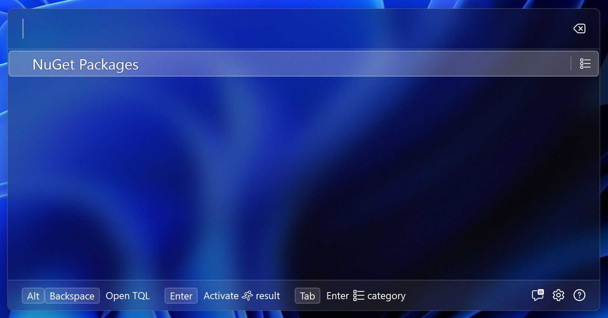

# Creating the category match

TQL distinguishes roughly two types of matches: categories and runnable matches.
Categories are what you search, and runnable matches is what the search returns.

We start with the category. Add a new class called **PackagesMatch** and paste
in the following contents:

```cs
using System.Windows.Media;
using Tql.Abstractions;

namespace TqlNuGetPlugin;

internal class PackagesMatch : ISearchableMatch
{
    public string Text => "NuGet Packages";
    public ImageSource Icon { get; }
    public MatchTypeId TypeId { get; }
    public string SearchHint => "Find NuGet packages";

    public Task<IEnumerable<IMatch>> Search(
        ISearchContext context,
        string text,
        CancellationToken cancellationToken
    )
    {
        throw new NotImplementedException();
    }
}
```

This is a base implementation for a searchable match. To let TQL know of the
match, we need to return an instance of it form the `GetMatches()` method in the
plugin. Update that method the following:

```cs
public IEnumerable<IMatch> GetMatches()
{
    yield return new PackagesMatch();
}
```

If you now start the app again and type a single space into the search box, your
match will show:



That's great progress already!

Next we'll add some supporting code to improve on this simple implementation.
