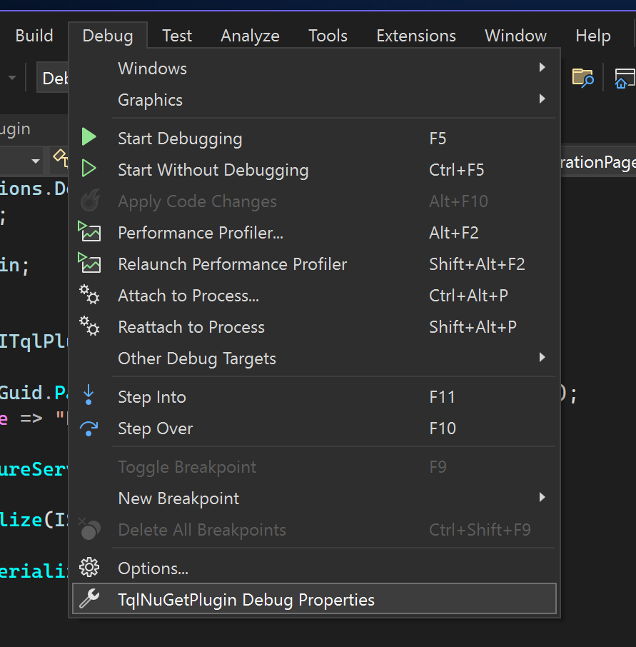

# Creating the plugin class

The entry point for TQL into your plugin is the plugin class. This class needs
to implement the `ITqlPlugin` interface from the
[TQLApp.Abstractions](https://www.nuget.org/packages/TQLApp.Abstractions) NuGet
package. TQL publishes two NuGet packages to help you create TQL plugins. The
second is a NuGet package with utility classes. Instead of adding the
abstractions NuGet package directly, you should add the
[TQLApp.Utilities](https://www.nuget.org/packages/TQLApp.Utilities) NuGet
package instead:

- Right click on the project file and click **Manage NuGet Packages...**.
- Search for "tqlapp.utilities" and click **Install**:

  

Next, replace the automatically generated **Class1.cs** file with a new file
called **Plugin.cs** and paste in the following content:

```cs
using Microsoft.Extensions.DependencyInjection;
using Tql.Abstractions;

namespace TqlNuGetPlugin;

[TqlPlugin]
public class Plugin : ITqlPlugin
{
    public static readonly Guid PluginId = Guid.Parse("74bc3db4-c951-442b-921c-887921772d64");

    public Guid Id => PluginId;
    public string Title => "NuGet";

    public void ConfigureServices(IServiceCollection services) { }

    public void Initialize(IServiceProvider serviceProvider) { }

    public IMatch? DeserializeMatch(Guid typeId, string value)
    {
        return null;
    }

    public IEnumerable<IMatch> GetMatches()
    {
        yield break;
    }

    public IEnumerable<IConfigurationPage> GetConfigurationPages()
    {
        yield break;
    }
}
```

You should replace the GUID with a new one. TQL plugins require GUIDs in a few
places. I find the
[Insert Guid](https://marketplace.visualstudio.com/items?itemName=MadsKristensen.insertguid)
Visual Studio extension useful for this.

TQL plugins must implement the `ITqlPlugin` interface and must specify the
`TqlPluginAttribute` attribute for TQL to pick them up.

In this guide we're not going to translate any of the assets of the plugin. If
you want to localize your plugin, you can use .NET resource dictionaries for
this. The TQL app and plugins use this to localize TQL itself.

To test the plugin, you need to run it using TQL. This guide assumes you have
the latest version of TQL installed locally. You need to change your launch
profile to use this version of TQL:

- Open the **Debug | TqlNuGetPlugin Debug Properties** menu item:

  

- Remove the automatically generated launch profile and replace it with a new
  one of type **Executable**.
- Configure the launch profile as follows:

  

  - Set the path to the executable to this:
    "%LOCALAPPDATA%\\Programs\\TQL\\Tql.App.exe". This configures the launch
    profile to use the locally installed TQL version.
  - Set the command line arguments to this: "--env NuGetPlugin --sideload .".
    This creates an isolated environment for your plugin and side loads it from
    the current working directory. This will be the build folder of your class
    library.
  - Rename the launch profile to e.g. **Run**.

If you now start the new launch profile, TQL should start with a clean
configuration. If you want to verify that your plugin is picked up, you can set
a break point in the `ConfigureServices` method.

Next we'll create the category match to function as the entry point into our
plugin for users.
