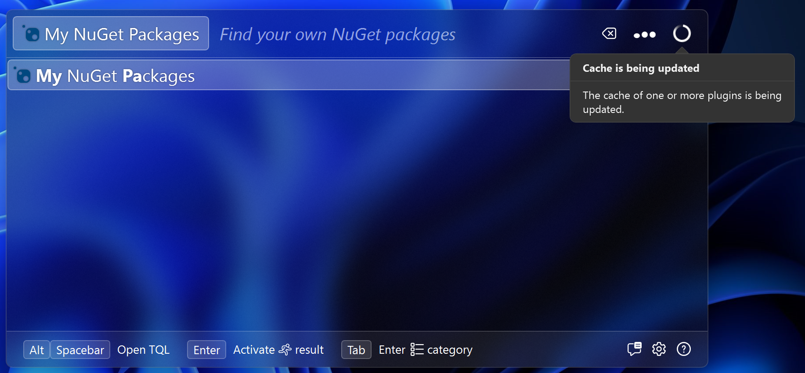

# Data caching

In the [Icon caching](Icon-caching.md) guide we looked at caching icons. In this
guide we'll look at caching data. This guide builds on the changes made to the
sample plugin in [Configuration UI](Configuration-UI.md).

This guide adds a cache to the plugin. This will cache the user's NuGet packages
to increase the performance of the My NuGet Packages category.

1. Create a new class called **CacheManager** and paste in the following code:

   ```cs
   using System.Collections.Immutable;
   using Tql.Abstractions;

   namespace TqlNuGetPlugin;

   internal class CacheManager : ICacheManager<Cache>
   {
       private readonly ConfigurationManager _configurationManager;
       private readonly NuGetClient _client;

       public CacheManager(ConfigurationManager configurationManager, NuGetClient client)
       {
           _configurationManager = configurationManager;
           _client = client;

           configurationManager.Changed += (_, _) =>
               OnCacheInvalidationRequired(new CacheInvalidationRequiredEventArgs(true));
       }

       public int Version => 1;

       public event EventHandler<CacheInvalidationRequiredEventArgs>? CacheInvalidationRequired;

       public async Task<Cache> Create()
       {
           var myPackages = default(ImmutableArray<PackageDto>);

           var userName = _configurationManager.Configuration.UserName;
           if (userName != null)
               myPackages = await GetMyPackages(userName);

           return new Cache(myPackages);
       }

       private async Task<ImmutableArray<PackageDto>> GetMyPackages(string userName)
       {
           return (
               from package in await _client.Search($"owner:{userName}", 1000)
               select new PackageDto(package.Identity.Id, package.IconUrl?.ToString())
           ).ToImmutableArray();
       }

       protected virtual void OnCacheInvalidationRequired(CacheInvalidationRequiredEventArgs e) =>
           CacheInvalidationRequired?.Invoke(this, e);
   }

   internal record Cache(ImmutableArray<PackageDto>? MyPackages);
   ```

   > [!IMPORTANT] The **ICacheManager** interface has an event called
   > **CacheInvalidationRequired**. TQL will listen to this event to get
   > notified of requests to rebuild the cache. In this example, we connect a
   > **Changed** event on the **ConfigurationManager** class to this event to
   > force rebuilding the cache every time the configuration changes.
   >
   > By following this pattern you can write you match classes to depend on the
   > cache being in sync with the configuration. In our case, we expect the
   > **MyPackages** property of the cache to be available when the user name is
   > set. We depend on this in the new version of the **MyPackagesMatch** class
   > below. This is only safe to do if you force rebuilding of the cache
   > whenever the configuration changes.

   > [!TIP] The purpose of the **Version** property is to make sure that the
   > cache is up to date with the version of the plugin. Caches are persisted to
   > disk to speed up startup of the app and your plugin. If you change the
   > cache DTO object, or the logic behind building the cache, you should
   > increment the value of the **Version** property so that TQL will rebuild
   > the cache after your plugin is updated.

2. Register the cache manager in the **ConfigureServices** method of the
   **Plugin** class by adding the following line:

   ```cs
   services.AddSingleton<ICacheManager<Cache>, CacheManager>();
   ```

3. Add a **Changed** event to the **ConfigurationManager** class:

   ```cs
   public event EventHandler? Changed;

   protected virtual void OnChanged() => Changed?.Invoke(this, EventArgs.Empty);
   ```

4. Raise the **Changed** event when the configuration changes. In the
   constructor, change the **ConfigurationChanged** event handler to the
   following:

   ```cs
   configurationManager.ConfigurationChanged += (_, e) =>
   {
       if (e.PluginId == Plugin.PluginId)
       {
           _configuration = ParseConfiguration(e.Configuration);
           OnChanged();
       }
   };
   ```

5. Replace the **Search** method in the **NuGetClient** class with the following
   implementation:

   ```cs
   private const int PageSize = 100;

   public async Task<List<IPackageSearchMetadata>> Search(
       string query,
       int maxResults = PageSize,
       CancellationToken cancellationToken = default
   )
   {
       var searchResource = await _sourceRepository.GetResourceAsync<PackageSearchResource>(
           cancellationToken
       );

       if (searchResource == null)
           throw new InvalidOperationException("Could not find search resource");

       var packages = new List<IPackageSearchMetadata>();

       for (var offset = 0; offset < maxResults; offset += PageSize)
       {
           packages.AddRange(
               await searchResource.SearchAsync(
                   query,
                   new SearchFilter(false),
                   offset,
                   PageSize,
                   NullLogger.Instance,
                   cancellationToken
               )
           );
       }

       return packages;
   }
   ```

6. The above method is called in the **PackagesMatch** class. The call to this
   method needs to be updated to allow for the new default parameter:

   Update the `return` statement at the end of the **Search** method to the
   following:

   ```cs
   return from package in await client.Search(text, cancellationToken: cancellationToken)
       select factory.Create(new PackageDto(package.Identity.Id, package.IconUrl?.ToString()));
   ```

7. Replace the implementation of the **MyPackagesMatch** class with the
   following:

   ```cs
   using System.Text.Json;
   using System.Windows.Media;
   using Tql.Abstractions;
   using Tql.Utilities;

   namespace TqlNuGetPlugin;

   internal class MyPackagesMatch(IMatchFactory<PackageMatch, PackageDto> factory, ICache<Cache> cache)
       : CachedMatch<Cache>(cache),
           ISerializableMatch
   {
       public override string Text => "My NuGet Packages";
       public override ImageSource Icon => Images.NuGetLogo;
       public override MatchTypeId TypeId => TypeIds.MyPackages;
       public override string SearchHint => "Find your own NuGet packages";

       protected override IEnumerable<IMatch> Create(Cache cache)
       {
           return cache.MyPackages!.Value.Select(factory.Create);
       }

       public string Serialize()
       {
           return JsonSerializer.Serialize(new PackagesDto());
       }
   }
   ```

   > [!TIP] This new implementation of the **MyPackagesMatch** class uses a
   > support class from the **Tql.Utilities** NuGet package. The **CachedMatch**
   > class simplifies categories that return matches based on cached data. The
   > above is a representative example of how this class is used.

If you now go into the **My NuGet Packages** category, you'll notice two loading
icons:



This new spinner is shown while the cache of a plugin is being updated. The
results appear when this completes:


You'll notice that the results now appear immediately and are updated as you
type.
