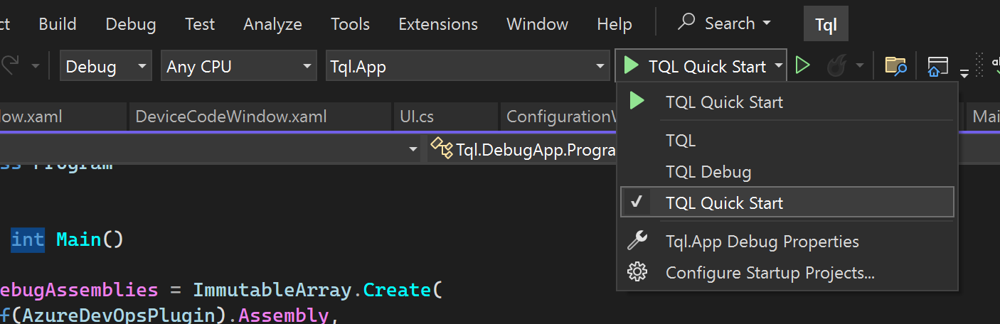

# Development environment

TQL is written in C# and WPF. You need a .NET development environment to be able
to make changes to it. I use Visual Studio Community edition myself, but Rider
should work also.

All code must be formatted using CSharpier. Have a look at the
[CSharpier Visual Studio plugin](https://marketplace.visualstudio.com/items?itemName=csharpier.csharpier-vscode)
for instructions on how to setup the Visual Studio plugin to enable automatic
formatting on save.

After you've cloned the repository, you can open the solution in Visual Studio.
The app doesn't require any special tools installed locally. You just need to
make sure you've picked ".NET desktop development" in the Visual Studio
Installer to have the right tools installed.

There are two ways to run the app. The main entry point into the app is the
Tql.App project. This is also the app users get when they install TQL. If you
need to e.g. test things related to the plugin system, this is the best way to
start the app.

Generally however you will use the Tql.DebugApp project. This app differs from
Tql.App in two ways:

- All plugins are loaded automatically. If you're creating a new plugin, you
  should make sure it's added to Tql.DebugApp also to simplify development.
- The app is run in debug mode. This enabled console logging, disables automatic
  updates and changes a few other minor things to simplify development.

TQL has support for environments:

Three environments have been added to the launch settings. Normally you use the
debug environment to not interfere with your main installation of TQL. There's a
separate Quick Start environment to simplify testing of the quick start
tutorial.
