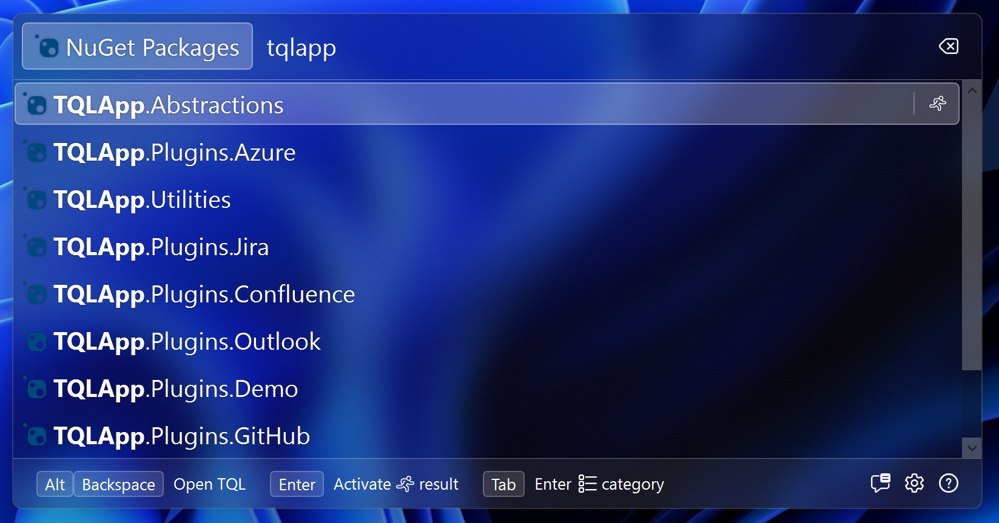

# Implementing search

Now on to the interesting stuff. In this step we're going to implement search
using the NuGet client NuGet packages.

Start by adding the
[NuGet.PackageManagement](https://www.nuget.org/packages/NuGet.PackageManagement)
NuGet package to your class library. Next, we'll create our own client class to
abstract over the NuGet package.

Add a new class called **NuGetClient** and paste in the following code:

```cs
using NuGet.Common;
using NuGet.Configuration;
using NuGet.Protocol.Core.Types;

namespace TqlNuGetPlugin;

internal class NuGetClient
{
    private readonly SourceRepository _sourceRepository;

    public NuGetClient()
    {
        _sourceRepository = new SourceRepository(
            new PackageSource("https://api.nuget.org/v3/index.json"),
            Repository.Provider.GetCoreV3()
        );
    }

    public async Task<IEnumerable<IPackageSearchMetadata>> Search(
        string query,
        CancellationToken cancellationToken
    )
    {
        var searchResource = await _sourceRepository.GetResourceAsync<PackageSearchResource>(
            cancellationToken
        );

        if (searchResource == null)
            throw new InvalidOperationException("Could not find search resource");

        return await searchResource.SearchAsync(
            query,
            new SearchFilter(false),
            0,
            100,
            NullLogger.Instance,
            cancellationToken
        );
    }
}
```

TQL uses Microsoft Dependency Injection. The `ConfigureServices` method on your
plugin allows you to add services to the DI container as it's being built. We
can use this to add the NuGetClient class to the DI container.

Update the `ConfigureServices` method in the `Plugin` class to the following:

```cs
public void ConfigureServices(IServiceCollection services)
{
    services.AddSingleton<NuGetClient>();
    services.AddTransient<PackagesMatch>();
}
```

This adds both the `NuGetClient` class and the `PackagesMatch` class.

Now we can add a constructor to our category match to have an instance of the
`NuGetClient` class injected. Add the following constructor to the
`PackagesMatch` class:

```cs
private readonly NuGetClient _client;

public PackagesMatch(NuGetClient client)
{
    _client = client;
}
```

This does require us to make a few more updates to the `Plugin` class to
instantiate the `PackagesMatch` class using the DI container. Update the
`Initialize` and `GetMatches` methods to the following:

```cs
private IServiceProvider? _serviceProvider;

public void Initialize(IServiceProvider serviceProvider)
{
    _serviceProvider = serviceProvider;
}

public IEnumerable<IMatch> GetMatches()
{
    yield return _serviceProvider!.GetRequiredService<PackagesMatch>();
}
```

We can now use this to implement search in the same class. Update the `Search`
method to the following:

```cs
public async Task<IEnumerable<IMatch>> Search(
    ISearchContext context,
    string text,
    CancellationToken cancellationToken
)
{
    if (string.IsNullOrWhiteSpace(text))
        return Array.Empty<IMatch>();

    await context.DebounceDelay(cancellationToken);

    return from package in await _client.Search(text, cancellationToken)
        select new PackageMatch(new PackageDto(package.Identity.Id));
}
```

There are a few important things to note here:

- We start by checking whether the user has actually typed in a search query.
  Some categories will return a default set of results if the search query is
  empty, but we don't. We just return an empty list instead.
- When we find that the user actually wants to search for something, we use the
  `DebounceDelay` method to implement debounce.
- Last we perform the search and turn the search results into a list of
  `PackageMatch` instances.

If you now run the project, you should be able to search for NuGet packages:



Next we'll update the `PackageMatch` class to allow the user to open the package
page.
