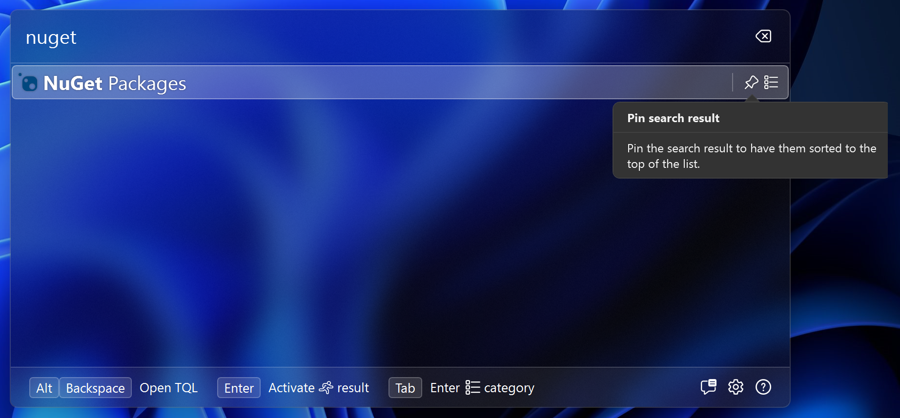
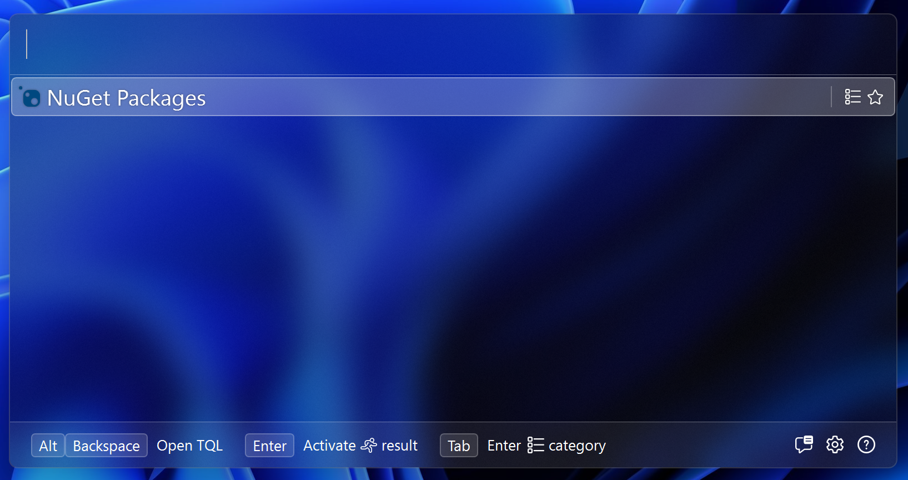
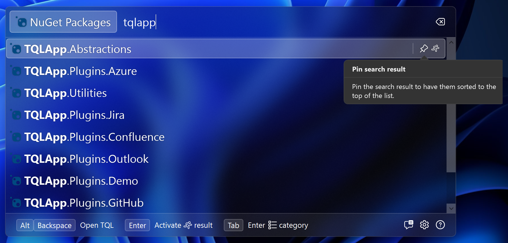
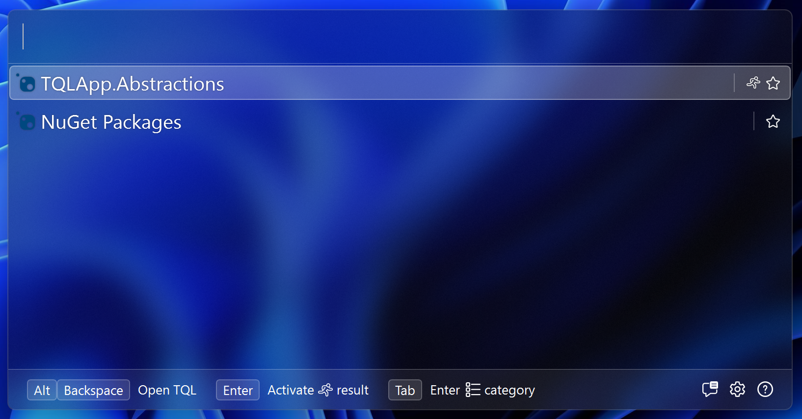

# Serialization

We haven't implemented serialization yet. When a user opens a category or
activates a match, it's automatically added to the history. Matches need to be
serializable thought for this to work. In this step we'll add serialization and
deserialization to our plugin.

We'll start with the `PackagesMatch` class. To allow TQL to serialize matches,
we need to add the `ISerializableMatch` interface. We haven't yet added a DTO
object for the `PackagesMatch` class, so start with adding this to the bottom of
the file:

```cs
internal record PackagesDto();
```

Then add this to the `PackagesMatch` class and add the following method to it:

```cs
public string Serialize()
{
    return JsonSerializer.Serialize(new PackagesDto());
}
```

Normally the DTO object should be passed into the constructor. We've done this
for the `PackageMatch` class already. This however isn't required, and the above
will work fine. However, if you'd later want to add support for e.g. multiple
NuGet feeds, you would refactor this to have the DTO object passed in.

The `PackageMatch` class does already have a DTO object, so we'll use that. Add
the `ISerializableMatch` interface to this class also and add the following
method:

```cs
public string Serialize()
{
    return JsonSerializer.Serialize(_dto);
}
```

This takes care of serialization. To allow TQL to deserialize matches, we need
to implement the `Deserialize` method on the `Plugin` class. This is possible.
We could use the GUIDs in the `TypeIds` class to detect which match and DTO
class we need to use and implement the logic that way. However, the utilities
NuGet package has some infrastructure to simplify this. We'll use that instead.

Create a new class called **PackagesType** and paste in the following code:

```cs
using Tql.Abstractions;
using Tql.Utilities;

namespace TqlNuGetPlugin;

internal class PackagesType : MatchType<PackagesMatch, PackagesDto>
{
    public override Guid Id => TypeIds.Packages.Id;

    public PackagesType(IMatchFactory<PackagesMatch, PackagesDto> factory)
        : base(factory) { }
}
```

And add a class called **PackageType** and paste in the following code:

```cs
using Tql.Abstractions;
using Tql.Utilities;

namespace TqlNuGetPlugin;

internal class PackageType : MatchType<PackageMatch, PackageDto>
{
    public override Guid Id => TypeIds.Package.Id;

    public PackageType(IMatchFactory<PackageMatch, PackageDto> factory)
        : base(factory) { }
}
```

The `MatchType` class handles deserialization for you. These implementations are
quite straight forward. The `MatchType` class also has a virtual `IsValid`
method. If you can validate DTO objects, e.g. against user configuration or
cached data, you should override this method to do so.

To use these classes, we need to add a `IMatchTypeManager` to the `Plugin`
class. Start with adding the following fields:

```cs
private readonly MatchTypeManagerBuilder _matchTypeManagerBuilder =
    MatchTypeManagerBuilder.ForAssembly(typeof(Plugin).Assembly);
private IMatchTypeManager? _matchTypeManager;
```

This adds a builder for the current assembly, and an field to store the built
manager in.

Update the `ConfigureServices` method to the following:

```cs
public void ConfigureServices(IServiceCollection services)
{
    services.AddSingleton<NuGetClient>();
    services.AddTransient<PackagesMatch>();

    _matchTypeManagerBuilder.ConfigureServices(services);
}
```

This allows the builder to add our match type classes to the DI container.

Update the `Initialize` method to build the manager:

```cs
public void Initialize(IServiceProvider serviceProvider)
{
    _serviceProvider = serviceProvider;

    _matchTypeManager = _matchTypeManagerBuilder.Build(serviceProvider);
}
```

And lastly update the `Deserialize` method to the following:

```cs
public IMatch? DeserializeMatch(Guid typeId, string value)
{
    return _matchTypeManager!.Deserialize(typeId, value);
}
```

If we now run the project again, first thing you'll notice is that the pin icon
appears if you hover over the NuGet packages match:



If you open the category, and re-open the search window, the NuGet packages
match will have been added to the history:



And, same for the package matches of course:



And after we activate it:



Next we'll look at the last interface you should consider implementing on every
match. This will allow users to copy links to your matches.
