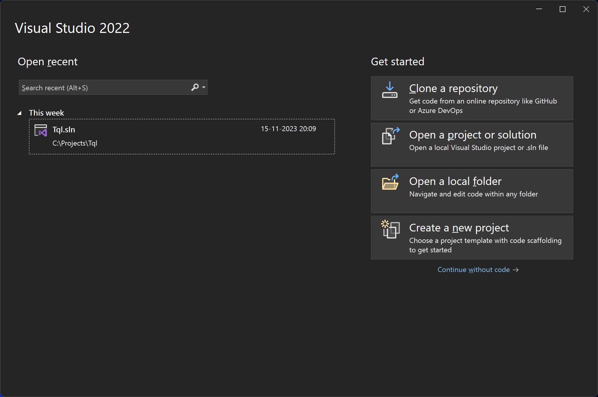
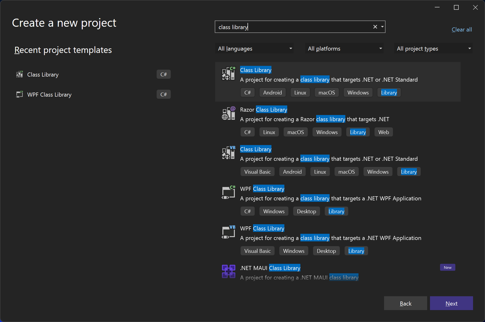
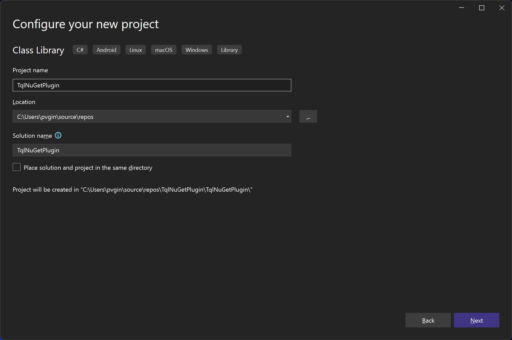
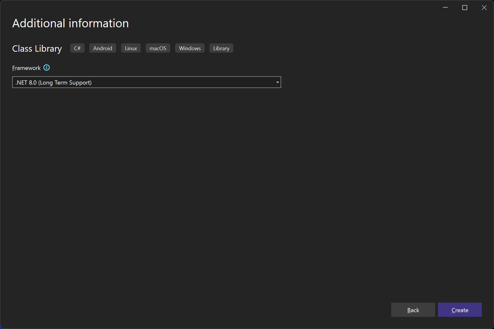
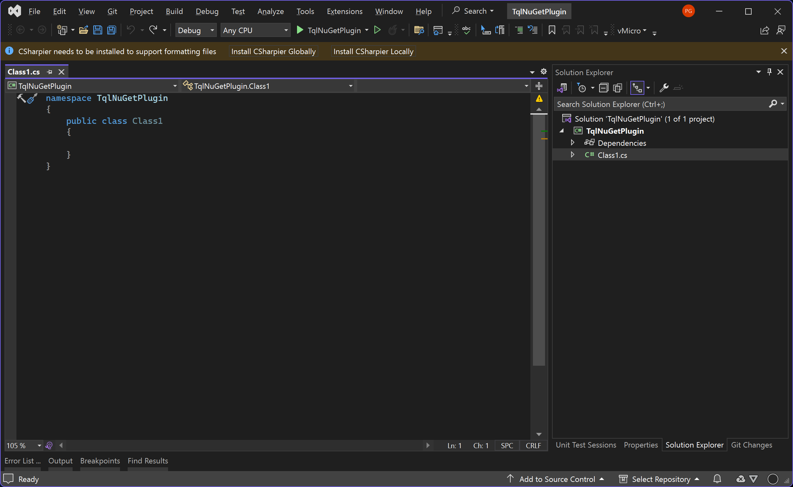
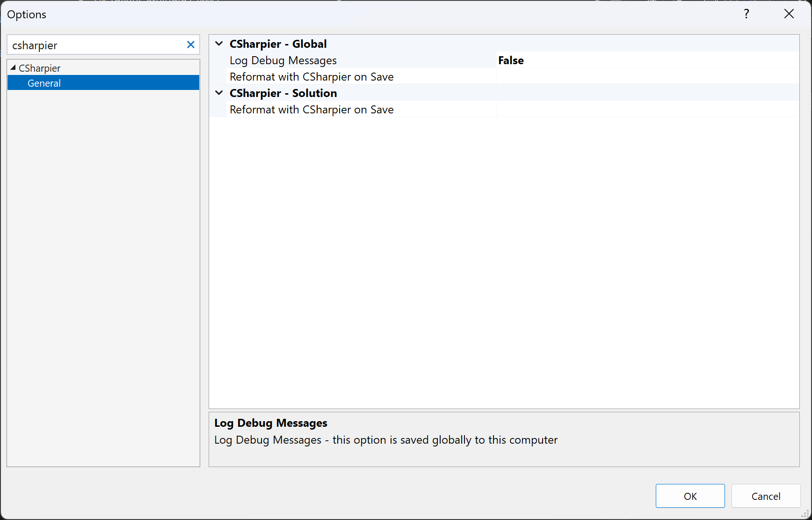
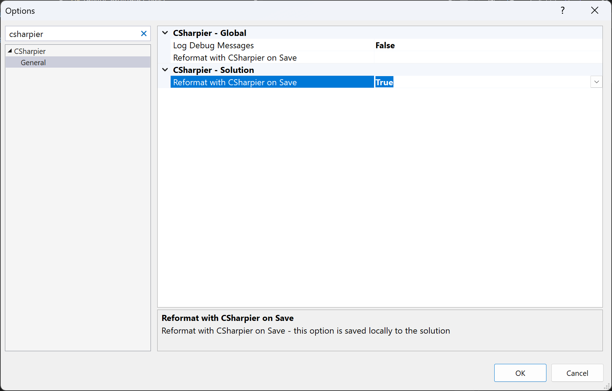

# Setting up a plugin project

In this guide we're going to create a TQL plugin to search https://nuget.org.
TQL plugins are C# class libraries. To create a TQL plugin, create a new
solution and C# class library in Visual Studio. If you don't yet have Visual
Studio installed, review the
[Development environment](Development-environment.md) before progressing with
the guide.

Complete the following steps:

- Open Visual Studio:

  

- Click **Create a new project**, search for "class library" and pick the C#
  version of the **Class Library** template:

  

- Give your plugin a name, e.g. "TqlNuGetPlugin":

  

- In **Framework**, pick the latest framework. TQL plugins must be .NET
  Framework 4.8. We'll change to that in a bit:

  

Visual Studio now opens the newly created project. I have the CSharpier plugin
installed. If you haven't, install that now. You should get a prompt from
CSharpier to install CSharpier locally. Click the **Install CSharpier Locally**
button to install CSharpier:



Then, configure CSharpier to run on save:

- Open the **Tools | Options** menu.
- Search for "csharpier" and open the **General** menu option:

  

- Change **CSharpier - Solution | Reformat with CSharper on Save** to **True**:

  

This would also be a good time to add your project to source control. You can do
this from Visual Studio directly, or use your favorite tool for this.

We still need to make a few changes to the project file to make sure the plugin
is going to work properly with TQL:

- Right click on the project and click **Edit Project File**.

- Change the project file to the following:

```xml
<Project Sdk="Microsoft.NET.Sdk">
  <PropertyGroup>
    <TargetFramework>net48</TargetFramework>
    <ImplicitUsings>enable</ImplicitUsings>
    <Nullable>enable</Nullable>
    <LangVersion>latest</LangVersion>
    <UseWPF>true</UseWPF>
    <UseWindowsForms>true</UseWindowsForms>
    <RestorePackagesWithLockFile>true</RestorePackagesWithLockFile>
  </PropertyGroup>
</Project>
```

- This makes the following changes to the project:
  - The target framework is .NET 4.8.
  - We use the latest C# language version.
  - WPF and Windows Forms is enabled.
  - NuGet lock files are enabled.

Next we'll add TQL dependencies and start implementation on the plugin class.
