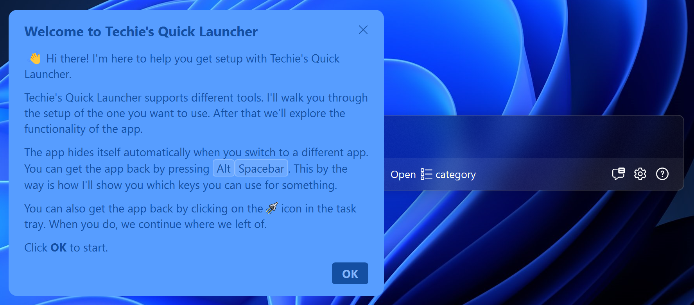

# Techie's Quick Launcher

Techie's Quick Launcher (TQL) is a launcher app for modern software development
tools. It's useful for anybody doing software development, from developers to
testers and product owners.

The primary use of the app is to quickly navigate to things you need every day,
like Agile boards in JIRA or Azure DevOps, work items and issues, Azure Portal
resources, and even people if you want to quickly start a teams chat.

## Beta

The project is currently in beta and I'm working on putting on the finishing
touches to be able to do a release. See
[1.0 milestone](https://github.com/TQLApp/TQL/milestone/1) for the progress
towards the first release.

## Features

- Support for Azure, Azure DevOps, JIRA, Confluence, GitHub, Outlook and
  Microsoft Teams.
- Built in plugin system to be able to add your own plugins.
- Quick start tutorial to get you up and running quickly.
- Advanced search capabilities. You'll forget how to use the web apps once you
  get used to TQL 😀.

## Installation

You need to download and install the setup to run Techie's Quick Launcher. Go to
the [latest release](https://github.com/TQLApp/TQL/releases/latest) page and
under **Assets**, download the **MSI** file. Have a look at the
[Getting started](https://github.com/TQLApp/TQL/wiki/Getting-started) page to
see how you can get yourself up and running.

## Getting started

When you first run the app, the quick start tutorial will guide you through the
setup of TQL. Just follow the steps to start using Techie's Quick Launcher.

There's more in depth documentation available at
[the wiki](https://github.com/TQLApp/TQL/wiki).

## Contribution guide

There are two ways in which you can contribute. If you have an idea for a plugin
for TQL, you can write your own. Have a look at the
[Create a plugin](https://tqlapp.github.io/TQL/Documentation/Create-a-plugin.html)
documentation on the developers website on how to do this. You don't have to
create a PR for this! You can publish your own plugin from your own repository
and have it work with TQL.

If you want to contribute to TQL directly, we welcome PRs. See the
[Development environment](https://tqlapp.github.io/TQL/Documentation/Development-environment.html)
wiki page for information on how to setup a local development environment for
TQL.

You can have a look at the issue log and find an issue you'd like to pick up. If
you have an idea for a feature request, best is to create a
[feature request issue](https://github.com/TQLApp/TQL/issues/new?assignees=&labels=&projects=&template=feature_request.md&title=)
for this and mention that you'd like to contribute it yourself. We'll use the
comments on the issue to discuss whether the feature is a good fit for the tool.

We also welcome localization of TQL. See the
[Localize TQL](https://tqlapp.github.io/TQL/Documentation/Localize-TQL.html)
wiki page for instructions on how to do this. I maintain English and Dutch
myself, and I welcome contributions for any other language.

## License

[MIT License](LICENSE).

## Contributions

I've used assets from other projects in this app. Thank you for making this
available!

- The logo and some other icons for the application came from
  https://iconduck.com/sets/universe-icons.
- The theme came from https://github.com/AngryCarrot789/WPFDarkTheme.
- Some icons came from https://github.com/microsoft/fluentui-system-icons
  (search engine is at https://fluenticons.co/).
