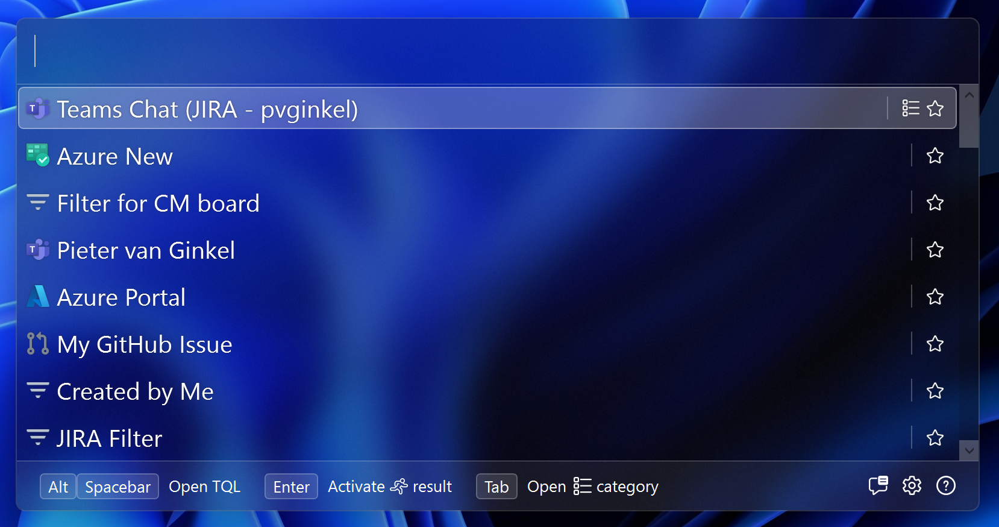

>>>>>CM:GREEN
# Techie's Quick Launcher

>>>>>CM:GREEN
Techie's Quick Launcher (TQL) is a launcher app for modern software development
>>>>>CM:GREEN
tools. It's useful for anybody doing software development, from developers to
>>>>>CM:GREEN
testers and product owners.

>>>>>CM:GREEN

>>>>>CM:GREEN
The primary use of the app is to quickly navigate to things you need every day,
>>>>>CM:GREEN
like Agile boards in JIRA or Azure DevOps, work items and issues, Azure Portal
>>>>>CM:GREEN
resources, and even people if you want to quickly start a teams chat.

>>>>>CM:GREEN
## Beta

>>>>>CM:GREEN
The project is currently in beta and I'm working on putting on the finishing
>>>>>CM:GREEN
touches to be able to do a release. See
>>>>>CM:GREEN
[1.0 milestone](https://github.com/TQLApp/TQL/milestone/1) for the progress
>>>>>CM:GREEN
towards the first release.

>>>>>CM:GREEN
## Features

>>>>>CM:GREEN
- Support for Azure, Azure DevOps, JIRA, Confluence, GitHub, Outlook and
>>>>>CM:GREEN
  Microsoft Teams.
>>>>>CM:GREEN
- Built in plugin system to be able to add your own plugins.
>>>>>CM:GREEN
- Quick start tutorial to get you up and running quickly.
>>>>>CM:GREEN
- Advanced search capabilities. You'll forget how to use the web apps once you
>>>>>CM:GREEN
  get used to TQL 😀.

>>>>>CM:GREEN
## Installation

>>>>>CM:GREEN
You need to download and install the setup to run Techie's Quick Launcher. Go to
>>>>>CM:GREEN
the [latest release](https://github.com/TQLApp/TQL/releases/latest) page and
>>>>>CM:GREEN
under **Assets**, download the **MSI** file. Have a look at the
>>>>>CM:GREEN
[Getting started](https://github.com/TQLApp/TQL/wiki/Getting-started) page to
>>>>>CM:GREEN
see how you can get yourself up and running.

>>>>>CM:GREEN
## Getting started

>>>>>CM:GREEN
When you first run the app, the quick start tutorial will guide you through the
>>>>>CM:GREEN
setup of TQL. Just follow the steps to start using Techie's Quick Launcher.

>>>>>CM:GREEN

>>>>>CM:GREEN
There's more in depth documentation available at
>>>>>CM:GREEN
[the wiki](https://github.com/TQLApp/TQL/wiki).

>>>>>CM:GREEN
## Contribution guide

>>>>>CM:GREEN
There are two ways in which you can contribute. If you have an idea for a plugin
>>>>>CM:GREEN
for TQL, you can write your own. Have a look at the
>>>>>CM:GREEN
[Create a plugin](https://tqlapp.github.io/TQL/Documentation/Create-a-plugin.html)
>>>>>CM:GREEN
documentation on the developers website on how to do this. You don't have to
>>>>>CM:GREEN
create a PR for this! You can publish your own plugin from your own repository
>>>>>CM:GREEN
and have it work with TQL.

>>>>>CM:GREEN
If you want to contribute to TQL directly, we welcome PRs. See the
>>>>>CM:GREEN
[Development environment](https://tqlapp.github.io/TQL/Documentation/Development-environment.html)
>>>>>CM:GREEN
wiki page for information on how to setup a local development environment for
>>>>>CM:GREEN
TQL.

>>>>>CM:GREEN
You can have a look at the issue log and find an issue you'd like to pick up. If
>>>>>CM:GREEN
you have an idea for a feature request, best is to create a
>>>>>CM:GREEN
[feature request issue](https://github.com/TQLApp/TQL/issues/new?assignees=&labels=&projects=&template=feature_request.md&title=)
>>>>>CM:GREEN
for this and mention that you'd like to contribute it yourself. We'll use the
>>>>>CM:GREEN
comments on the issue to discuss whether the feature is a good fit for the tool.

>>>>>CM:GREEN
We also welcome localization of TQL. See the
>>>>>CM:GREEN
[Localize TQL](https://tqlapp.github.io/TQL/Documentation/Localize-TQL.html)
>>>>>CM:GREEN
wiki page for instructions on how to do this. I maintain English and Dutch
>>>>>CM:GREEN
myself, and I welcome contributions for any other language.

>>>>>CM:GREEN
## License

>>>>>CM:GREEN
[MIT License](LICENSE).

>>>>>CM:GREEN
## Contributions

>>>>>CM:GREEN
I've used assets from other projects in this app. Thank you for making this
>>>>>CM:GREEN
available!

>>>>>CM:GREEN
- The logo and some other icons for the application came from
>>>>>CM:GREEN
  https://www.flaticon.com/packs/universe-16.
>>>>>CM:GREEN
- The theme came from https://github.com/AngryCarrot789/WPFDarkTheme.
>>>>>CM:GREEN
- Some icons came from https://github.com/microsoft/fluentui-system-icons
>>>>>CM:GREEN
  (search engine is at https://fluenticons.co/).
>>>>>CM:GREEN
- The original grab cursor came from
>>>>>CM:GREEN
  https://www.svgrepo.com/svg/372329/cursor-hand-grab. The one I'm using is
>>>>>CM:GREEN
  modified to better support high DPI.
