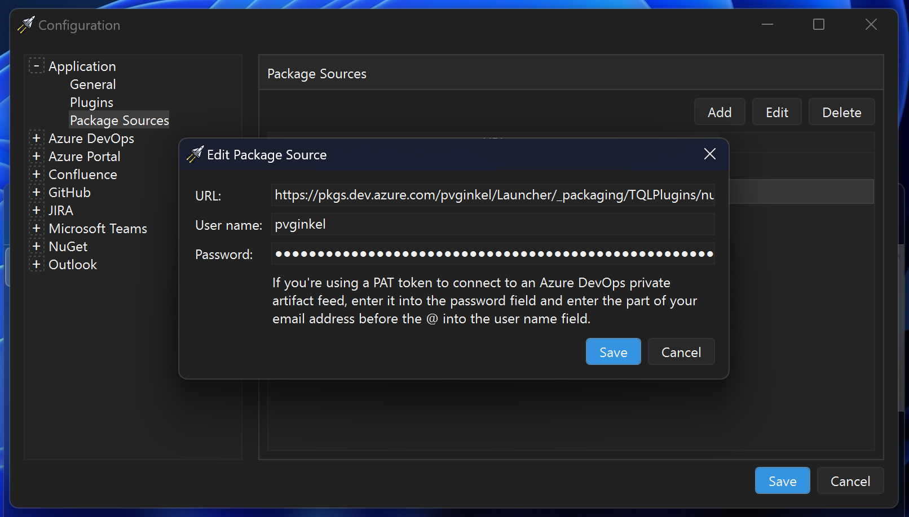
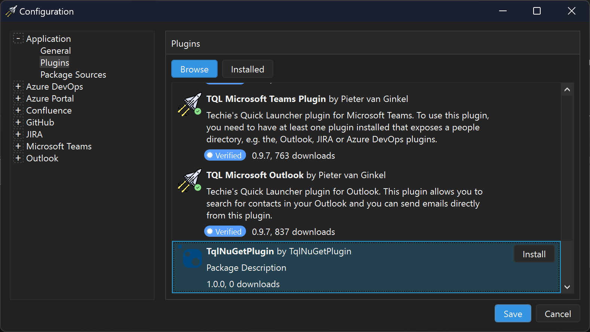

# Publishing plugins

Plugins are published as NuGet packages. TQL will show plugins that have the
`tql-plugin` tag set.

TQL has the following requirements of a plugin:

- It must have the `tql-plugin` tag.
- It must have `net8.0-windows` as the target framework.
- It must have a dependency on the **TQLApp.Abstractions** NuGet package.

> [!IMPORTANT] When installing a plugin, TQL will automatically resolve and
> install any dependencies. It uses the native NuGet libraries for this.

> [!IMPORTANT]
>
> Plugins are not isolated from each other. They are all loaded into the same
> TQL app. Because of this, assembly conflicts can occur.
>
> TQL resolves assembly conflicts as follows:
>
> - If any plugin requests a DLL that is installed as part of TQL itself, that
>   version is used regardless of the version of the DLL the plugin uses.
> - Otherwise, the highest version across all plugins is used. If two plugins
>   have the same DLL, the DLL with the highest version is used regardless of
>   which plugin is requesting the DLL.
>
> Tests were done to load multiple versions of the the same DLL. This should
> technically be possible, but caused unexpected behavior.
>
> The chance is small this should ever cause an issue for you. If it does,
> please raise an issue on GitHub.

In this guide, I'm publishing the NuGet package to a private artifact feed
hosted on a free Azure DevOps account. TQL supports private artifacts feeds and
the guide shows how to set one up.

1. Configure the project to generate packages on build and add the tag. Edit the
   **.csproj** file and add the following lines to the bottom of the
   **PropertyGroup** element:

   ```xml
   <PropertyGroup>
     ...
     <GeneratePackageOnBuild>true</GeneratePackageOnBuild>
     <PackageTags>tql-plugin</PackageTags>
   </PropertyGroup>
   ```

   > [!TIP] NuGet has many more options you can configure. You should configure
   > all of these just like you would configure normal NuGet packages.

2. Add a **nuget.config** file to the root of your solution. In my case I'm
   using the following contents, but you'll have to update this to specify your
   on artifact feed. If you're publishing your NuGet package to
   https://nuget.org, you can skip this step.

   ```xml
   <?xml version="1.0" encoding="utf-8" ?>
   <configuration>
     <packageSources>
       <add
         key="TQLPlugins"
         value="https://pkgs.dev.azure.com/pvginkel/Launcher/_packaging/TQLPlugins/nuget/v3/index.json" />
     </packageSources>
   </configuration>
   ```

3. Download the **nuget.exe** application from the
   [NuGet downloads](https://www.nuget.org/downloads) page.

4. Push the NuGet package:

   ```bat
   nuget.exe push -Source "TQLPlugins" -ApiKey az ...\TqlNuGetPlugin.1.0.0.nupkg
   ```

5. Open the configuration window of the TQL App. Don't do this through the debug
   profile setup for the guide. Instead, use your primary TQL environment.

6. Navigate to the **Package Sources** configuration page and add a package
   source. Enter all required fields and save the package source and
   configuration:

   

7. Open the configuration window again and go the **Plugins** page. The
   published plugin will now show:

   

8. Install the plugin. The new categories will be available once TQL has
   restarted.
